## 信息检索1 信息检索基础

### 1.1 布尔检索及倒排索引

#### 1.1.1 信息检索简介

学术意义上的**信息检索(information retrieval)**定义如下：信息检索是从大规模**非结构化数据**(通常是**文本**)的集合(通常保存在计算机上)中找出满足用户信息需求的资料(通常是**文档**)的过程。信息检索已经替代传统的数据库式搜索迅速成为信息访问的主要形式。

术语**“非结构化数据”(unstructured data)**指的是那些没有清晰和明显的语义结构的数据，而计算机不易处理这些数据。与之对应的是**“结构化数据”(structured data)**，最典型的例子就是关系型数据库。有时，我们也把网页这种具有格式标记的数据称为**“半结构化数据”(semi-structured data)**。

用户对文档的浏览、过滤或对返回的文档进行进一步处理也属于信息检索的研究范畴，例如**文档的分类、聚类以及文档的潜在语义分析**等。

信息检索可以按照所处理的数据规模进行区分，第一个级别是**web搜索**，第二个级别是**小规模搜索**(如个人信息检索，即PC中以及软件中的搜索功能)。介于两个级别之间的信息检索主要面对的是**中等规模的数据**，包括面对企业、机构和特定领域的搜索，比如公司内部文档、专利库或者文献的搜索。事实上，仅有少数Web搜索公司，更多的是个人和企业搜索这两类问题。

#### 1.1.2 布尔检索的例子

假设要在《莎士比亚全集》这本书中查找包含Brutus和Caesar但不包含Calpurnia的剧本，一种办法就是从头到尾扫描所有剧本，该方式称为**线性扫描(grepping)**，它来自于Unix下的一个文本扫描命令grep。然而，该方式对于大规模文档集查找速度极其缓慢，匹配方式不灵活，且无法对结果进行排序。

一种非线性扫描的方式是实现给文档建立**索引(index)**。给定《莎士比亚全集》的词表(大约32000个)，假定**对每篇文档(这里指剧本)都事先记录它是否包含词表中的某个词**，结果就会得到一个由布尔值构成的**词项-文档关联矩阵**。**词项(item)**是索引的单位，它通常可以用词表示，但也不一定就是词，比如**Hong Kong是词项但不是词**。下图展示了词项-文档关联矩阵的示例，其中每行表示一个单词，每列表示一个剧本。当词$t$在剧本$d$中存在时，矩阵元素$(t,d)$的值为1，否则为0。

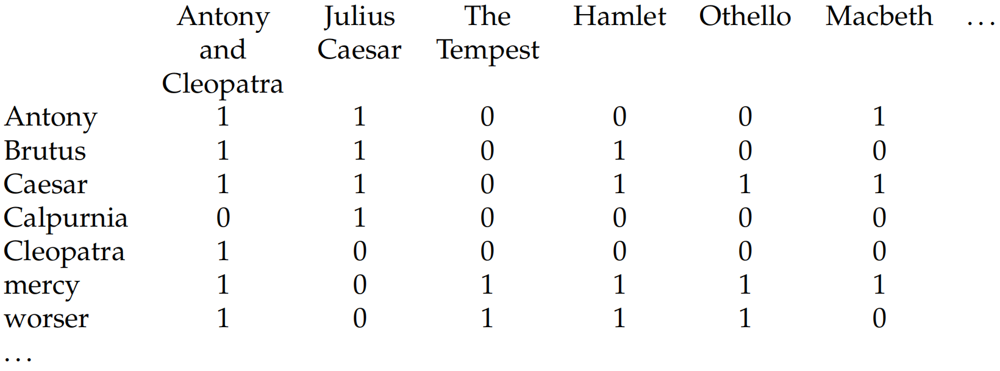

为相应查询Brutus AND Caesar AND NOT Calpurnia，取三个单词对应的行向量，并对单词Calpurnia对应的向量求反，然后进行基于位的操作，得到：$110100 \text{ AND } 110111 \text{ AND } 101111=100100$。结果向量中第一个和第四个元素为1，表明该查询对应的剧本是Antony and Cleopatra和Hamlet。

以上便是**布尔检索(bool retrieval)**。布尔检索模型接受布尔表达式查询，即通过AND、OR及NOT等逻辑操作符将词项连接起来的查询。在该模型下，**每篇文档只被看成是一系列词的集合**。

我们的目标是开发一个能处理**ad hoc检索**任务的系统，即用户的信息需求通过一次性的、由用户提交的查询传递给系统，系统从文档集中返回与之相关的文档。**信息需求(information need)**指的是用户想查找的信息主题，它和**查询(query)**并不是一回事，后者由用户提交给系统以代表其信息需求。如果一篇文档包含对用户需求有价值的信息则认为是**相关的(relevant)**。对检索系统的**效果(effectiveness)**即搜索结果的质量进行评价，通常需要知道某个查询返回结果的两方面的统计信息：

(1) **精准率(precision)**：返回结果中真正和信息需求相关的文档所占的百分比，也叫**查准率**。

(2) **召回率(recall)**：所有和信息需求真正相关的文档中被检索系统返回的百分比，也叫**查全率**。

#### 1.1.3 倒排索引

当数据量极大时，上述矩阵将变得非常大且非常稀疏，难以存储并且速度很慢。显然，**只记录原始矩阵中1的位置**的表示方法比词项-文档矩阵更好(类似矩阵压缩)。该思路引出信息检索中第一个核心概念——**倒排索引(inverted index)**，即一个类似邻接表的数据结构，表头为词项词典，即文档集中出现的所有词项；右部分为一个链表，表示哪些文档中含有对应表头的词项。

倒排索引中每个元素称为**倒排记录(posting)**，每个词项对应一个的表称为倒排记录表(posting list)，所有词项的倒排记录表一起构成全体**倒排记录表(postings)**。通常词典按照字母顺序进行排序，而倒排记录表则按照文档编号进行排序。

**建立倒排索引的主要步骤如下**：

(1) 收集需要建立索引的**文档**；

(2) 将每篇文档转换成一个个**词条(token)的列表**，这个过程称为**词条化(tokenization)**或**切词**；

(3) 进行**语言学的预处理**(形态、时态等)，产生归一化的词条来作为词项；

(4) 对所有文档按照其中出现的词项来建立倒排索引，索引包括**字典和全体倒排记录表**。

建立索引最核心的步骤是**将列表按照词项的字母顺序进行排序**，倒排记录表也会**按照文档的编号进行排序**。索引构建的结果分成词典和倒排记录表两部分，其中词典也可以记录一些统计信息，比如出现某词项的文档的数目，即**文档频率(document frequency)**，也就是每个倒排记录表的长度。得到索引后，**词典往往存放在内存中，而倒排记录表往往放在磁盘上**。

对内存中的一个倒排记录表，可以采取两种好的存储数据结构：**单链表**或**变长数组**。如果索引更新不是很频繁的话，**变长数组的存储方式在空间上更为紧凑，遍历也更快**。

通过两个文档Doc1和Doc2来构建倒排索引的示例如下：

Doc1: I did enact Julius Caesar: I was killed i' the Capitol; Brutus killed me.

Doc2: So let it be with Caesar. The noble Brutus hath told you Caesar was ambitious.

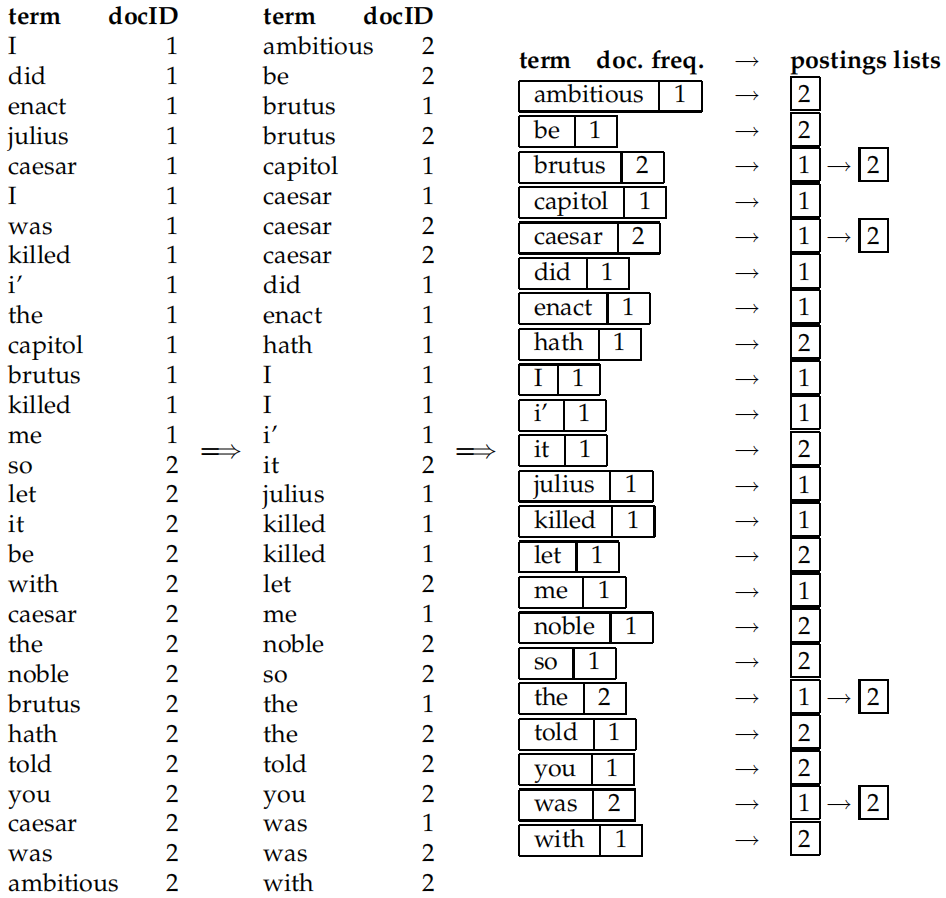

#### 1.1.4 布尔查询的处理

以简单的AND查询为例：Brutus AND Calpurnia，布尔检索的过程如下：

(1) 在词典中定位Brutus并返回其倒排记录表；

(2) 在词典中定位Calpurnia并返回其倒排记录表；

(3) 对两个倒排记录表求交集。

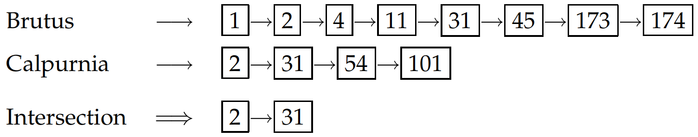

由于倒排记录表中文档编号是有序的，因此可以用**合并算法(merge algorithm)**(类似于归并排序中的操作)在复杂度为$\Theta(N)$的要求下快速求出多个文档的交集。该算法可以扩展用于处理更复杂的查询。

**查询优化(query optimization)**指的是如何通过组织查询的处理过程来使处理工作量最小。例如多个AND连接的查询，如果先合并短的倒排记录表(这里用到词项的文档频率，即倒排记录表的长度)，那么所有中间结果的大小都不会超过最短的倒排记录表，这样处理所需要的工作量很可能最少。很多情况下，查询条件往往是由纯“与”操作构成的。在这种情况下，不是将倒排记录表合并看成两个输入加一个输出的不同函数，而是**将每个返回的倒排记录表和当前内存中的中间结果进行合并**，这样做的效率更高。

#### 1.1.5 对基本布尔操作的扩展及有序检索

和布尔检索模型相对的是排序检索模型或**有序检索模型(ranked retrieval model)**，有序检索模型不是通过具有精确语义的逻辑表达式来构建查询，而往往是采用一个或者多个词来构成**自由文本查询(free text query)**。有序检索系统要能够确定哪篇文档最能满足用户的需求。例如：

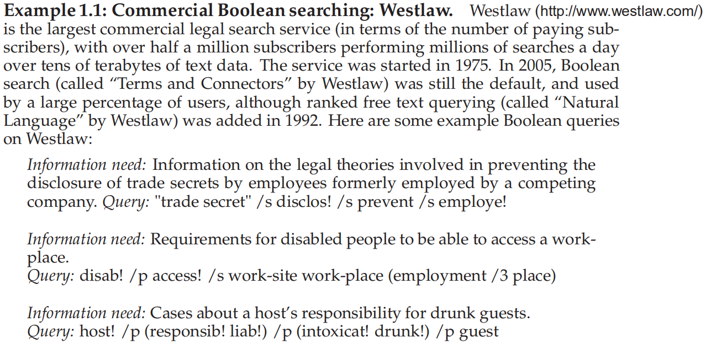

可以注意到，上面的例子中不仅包含了语义非常精确的长查询，还使用了邻近操作符，这些在通常的Web搜索中都很少见。该系统按照时间对返回结果排序，越新的结果排序越靠前。

**倒排索引和布尔检索是信息检索的基础**。为了满足更高要求的查询过程，应该考虑更加丰富的查询模型以及各种用于高效处理查询的增强索引结构：

(1) 要更好地确定词典中的**词项表**，提供一个能容忍**拼写错误**及当查询和文档中的词语**表达不一致**时的检索方法；

(2) 对能够表示某概念的**复合词**或短语(如operating system)进行搜索是非常有用的。如上面Westlaw的例子所示，有时我们希望能够执行诸如Gates NEAR Microsoft这类的邻近查询。为处理这类查询，**索引结构**必须要改进。

(3) 布尔模型只记录词项存在或不存在，但是往往需要累加各种证据来得到文档相关的**可信度**。比如，如果一个查询项在某文档中多次出现，我们会给该文档赋予一个**权重**，该权重会比仅仅出现一次查询项的文档要高。为了实现这个目的，需要引入**词项频率**的概念。

(4) 布尔查询仅仅返回一个**无序**的文档集，但是我们往往需要对返回的结果进行排序，这就需要提供一个机制，可以在给定查询的情况下对每个文档的好坏进行评分。

近年来，ad hoc搜索已占据了主导地位，不仅是Web搜索引擎，还包括大型电子商务网站的非结构化数据搜索。尽管主要的搜索引擎对自由文本查询的重视程度不尽相同，但实际上它们背后的大部分索引和查询技术都基本一致。另外，随着时间的推移，**很多Web搜索引擎都或多或少增加了扩展布尔模型的一部分操作**，其中短语查询非常流行，大部分搜索引擎都支持部分布尔操作。

### 1.2 词项词典及倒排记录表

#### 1.2.1 文档分析及编码转换

作为索引构建过程的输入，数字文档一般由文件中或者Web服务器上的一系列**字节**组成。因此，文档处理的第一步往往是**将这些字节序列转换成线性的字符序列**。对于ASCII编码的英文文本来说，处理起来十分容易，然而现实中字符序列可能采取**各种单字节或者多字节的编码方式(比如Unicode中的UTF-8编码等)**，也可能采用不同国家、不同厂家的特定编码方式。因此，为了实现从字节序列到字符序列兑换，首先要正确地判断出文档的编码方式。可以将该判断过程看成一个基于机器学习的分类问题。

有时，我们必须从一些**二进制文档(如.doc或者.zip)**中得到字符序列。这时也必须先确定文档的格式，然后才能采用合适的编码方式还原出字符序列。即便是对于纯文本文档，有时也需要额外的转换过程。比如对于XML文档，一些转义字符就需要转换成它原本代表的字符，如**&amp需要转换成&**。此外，如果文档中同时存在文本和非文本(图片)部分，可以暂时不考虑非文本部分，假设文档只由一系列的文本字符构成。

在文档编码确定后，下一步需要确定索引的文档单位，即**索引粒度(indexing granularity)**。对于长文本的集合，例如一个书库，**将整本书作为索引单位通常是个糟糕的做法**。在这样的请情况下，如果搜索Chinese toys，那么很可能返回这样一本书，它的第一章提到了China，最后一章提到了toys。这显然不是我们想要的结果，可取的做法是将每章或每段看成一个**微型文档(mini-document)**来建立索引。

#### 1.2.2 词项集合的确定

(1) **词条化**：词条化是将给定的字符序列拆分成一系列子序列的过程，每个子序列称为一个**词条(token)**。在这个过程中，可能会同时去掉一些特殊字符，如标点符号等。词条化的难点是词的划分问题，尤其是在中文等语言中。

(2) **去除停用词**：一些常见词在文档和用户需求进行匹配时价值并不大，需要彻底从词汇表中去除。这些词称为**停用词(stop word)**。一个常用的停用词表生成方法就是将词项按照文档集频率(每个词项在文档集中出现的频率)从高到低排列，然后手工选择那些语义内容**与文档主题关系不大的高频词**作为停用词。

(3) **词项归一化(normalization)**：将看起来不完全一致的多个词条归纳成一个**等价类**，以便在它们之间进行匹配。其包括重音及变音符号处理问题、大小写转换问题、英语中英式拼写和美式拼写的转换等一系列问题。

(4) **词干还原和词形归并**：目的是减少词的屈折变化形式，并且有时会将派生词转化为基本形式，比如am, are, is会转换为be。然而，**词干还原(stemming)**和**词形归并(lemmatization)**这两个术语代表的意义是不同的。前者通常指的是一个很粗略的去除单词两端词缀的启发式过程，并且希望大部分时间它都能达到这个目的，这个过程也常常包括去除派生词缀。而词形归并通常指利用词汇表和词形分析来去除屈折词缀，从而返回词的原形的过程。

#### 1.2.3 基于跳表的倒排记录表快速合并算法

采用**跳表(skip list)**可以在亚线性时间内完成倒排记录表的合并过程。跳表在构建索引的同时建立，能够提供捷径来跳过那些不可能出现在检索结果中的记录项。以下图为例，考虑**两个结果表的快速合并问题**。假定我们在两个表中遍历一直到发现共同的记录8为止，将8放入结果表之后继续移动两个表的指针。假定第一个表的指针移到16，而第二个表的指针移到41，两者中较小项为16。这时候我们并不继续移动上面的表指针，而是检查跳表指针的目标项，此时为28，仍然比41小，因此此时可以直接把上表的指针移到28处，这样就跳过了19和23两项。

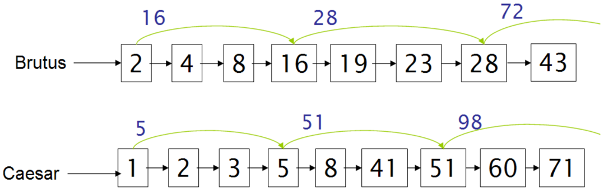

另一个问题是，在什么位置上放置跳表指针。这里存在一个**指针个数和比较次数之间的折中问题**。跳表指针越多意味着跳跃的步长越短，那么在合并过程中跳跃的可能性也更大，但这同时也意味着需要更多的指针比较次数和更多的存储空间。跳表指针越少意味着更少的指针比较次数，但同时也意味着更长的跳跃步长，也就是说意味着更少的跳跃机会。一个简单的启发式策略是，在每个$\sqrt P$处均匀防止跳表指针，其中$P$是**倒排记录表的长度**。

基于跳表指针的倒排记录表合并算法如下：

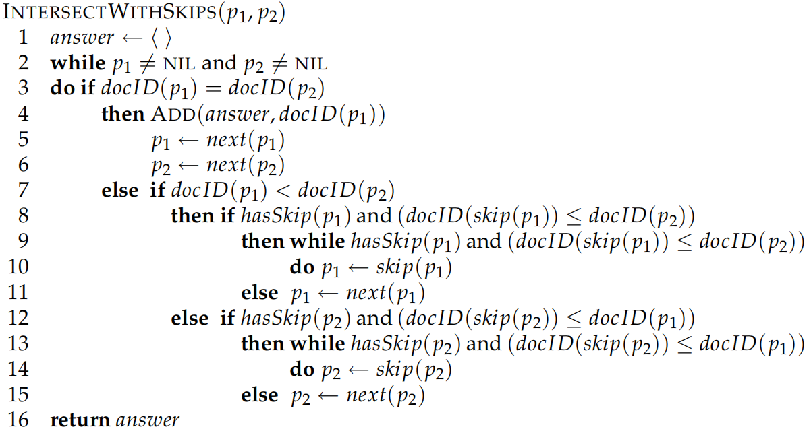

#### 1.2.4 含位置信息的倒排记录表及短语查询

很多时候用户希望将类似Stanford University的查询中的两个词看成一个整体。据统计，大概有10%的Web查询是短语查询。通常有两种支持短语查询的方式：

(1) 二元词索引：将文档中的每个连续词看成一个短语。例如，文本Birds eat apples会产生如下的二元连接词对(biword)：Birds eat, eat apples。这种方法将每个连续词对看成词项，这样马上就能处理两个词构成的短语查询。二元次索引的概念可以扩展到更长的词序列，如果索引中包含变长的词序列，通常就称为**短语索引(phrase index)**。

(2) 位置信息索引：**位置信息检索(positional index)**是实际中更常用的一种方式。例子如下：

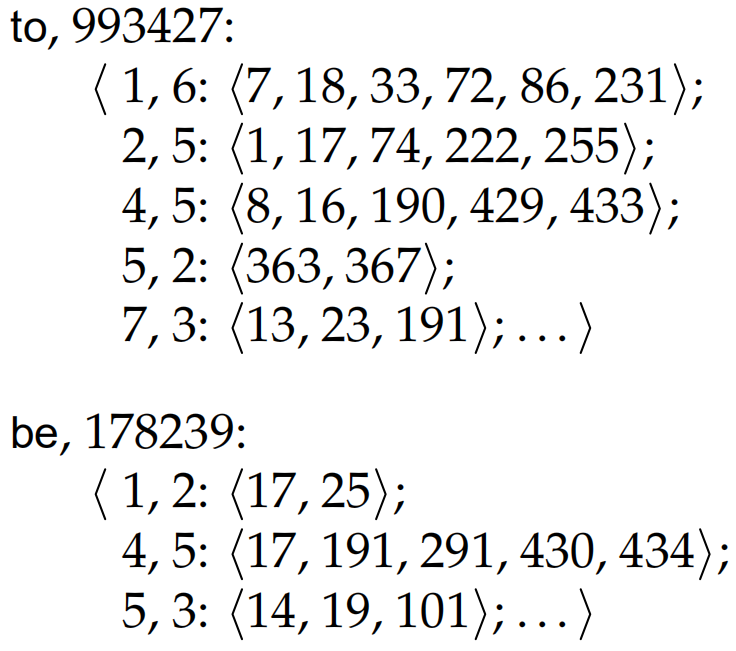

上例中，单词to的文档频率是993,427，在文档1中出现6次，位置分别是7, 18, 33等。查询时不只是简单地判断两个词项是否出现在同一文档中，而且还需要检查它们的出现位置关系与查询当中是否保持一致，这就需要计算出词之间的偏移距离。

### 1.3 词典及容错式检索

#### 1.3.1 词典搜索的数据结构

给定倒排索引表及查询，首要任务是确定每个查询词项是否在词汇表中。如果在，则返回该词项对应的倒排记录表的指针。词汇表的查找操作往往采用一种称为**词典(dictionary)**的经典数据结构，并且主要有两大类解决方案：哈希表方式和搜索树方式。

在IR中，词汇表中的每个条目(词项)常常称为**键(key)**。由于**哈希表存在冲突问题，并且难以处理查询词项存在轻微变形的情况**，因此常用搜索树的数据结构对词典进行存储。在实际应用中，**B树**(一种多路平衡查找树)是一种普遍使用的字典存储结构。

#### 1.3.2 通配符查询

用户对于拼写不确定、查找不同拼写版本以及查询词项所有变形的情况适用于通配符查询。形如mon\*的查询称为**尾通配符查询**，这对于搜索树来说**易于查找**；形如\*mon形式的查询称为**首通配符查询**，可以引入词典的**反向B树结构**进行查询，在该结构中，原来B树种的每个从根到叶子路径所代表的的词项全部反过来写。**同时利用B树和反向B树，可以实现跟一般的单通配符查询**，例如se\*mon。具体处理时，通过B树来返回所有前缀为se的词项子集$W$，再通过反向B树来返回所有后缀为mon的词项子集$R$，然后对$W$和$R$求交集，之后对交集进行扫描，当前缀和后缀相同时去掉它们对应的词项，得到结果集合。最后通过普通倒排索引来获取结果集合中所有词项对应的文档。

另一种常用的通配符查询处理方法叫做**轮排索引(permuterm index)**，它是倒排索引的一种特殊形式。首先，在字符集中引入一个新的符号\$，用于标识词项结束。因此，词项hello在这里表示成扩展的词项hello\$。然后，构建一个轮排索引，其中对扩展词项的每一个旋转结果都构造一个指针来指向原始词汇，例如，hello\$有如下旋转：

hello\$、ello\$h、llo\$he、lo\$hel、o\$hell、\$hello

我们将词项旋转后得到的集合称为**轮排词汇表(permuterm vocabulary)**。利用轮排索引来处理通配符查询的方式如下，考虑通配符m\*n，这里的关键是**将查询进行旋转让\*号出现在字符串末尾**，即得到n\$m\*。下一步，**在轮排索引中查找该字符串，实际上等价于查找某些词项的结果**。

#### 1.3.3 拼写校正

对于大多数**拼写校正(spelling correction)**算法而言，存在以下两个**基本原则**：(1) 对于一个拼写错误的查询，在其可能的正确拼写中，选择距离最近的一个。(2) 当两个正确拼写查询邻近度相等或相近时，选择更常见的那个。

拼写校正的方法可大致分为两类：**词项独立(isolated-term)**方法和**上下文敏感(context-sensible)**方法。在词项独立的校正方法中，不管查询中包含多少个查询词项，其**每次只对单个查询词项进行校正**，即词项是相互独立的。而上下文敏感的方式会**考虑每个词项的上下文**进行校正。

**编辑距离方法**及**k-gram重合度算法**是两种常用的词项独立方法。编辑距离方法计算与用户查询词项具有最小编辑距离的词项，若使用穷举搜索，则开销很大；最简单的启发式方法是**将搜索限制在与查询词具有相同首字母的词项子集上**。还可使用轮排索引实现更复杂的做法。k-gram重合度算法利用k-gram索引来查找与查询具有很多公共k-gram的词项，实际上是对查询字符串中k-gram的倒排记录表进行单遍扫描的过程。下图给出查询bord的2-gram索引的一个片段：

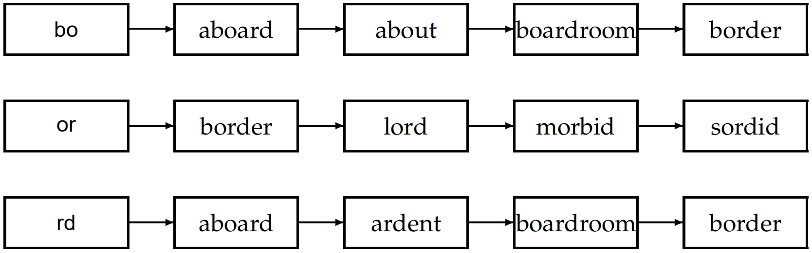

### 1.4 索引的构建与压缩

#### 1.4.1 索引的构建

(1) **构建不包含位置信息的索引**：首先扫描一遍文档集合，得到所有的词项-文档ID对。然后**以词项为主键，文档ID为次键进行排序**。最后将每个词项的文档ID组织成倒排记录表，并计算诸如词项频率或者文档频率的统计量。对于小规模文档集来说，上述过程均可在内存中完成，在大规模文档集条件下，需要引入**二级存储介质**进行外部排序。**基于块的排序索引算法(blocked sort-based indexing algorithm, BSBI)**是一种解决的办法：1. 将文档集分割成几个大小相等的部分；2. 将每个部分的词项ID-文档ID对排序；3. 将中间产生的临时排序结果存放到磁盘中；4. 将所有的中间文件合并成最终的索引。

(2) **构建分布式索引**：实际中，文档集都很大，在单台计算机上很难高效地构建索引。对Web构建规模合理的索引通常需要大规模的**计算机集群(cluster)**，Web搜索引擎同行使用分布式索引构建算法来构建索引，其索引结果也是分布式的，往往按照词项或文档进行分割后分布在多台计算机上。通常使用**MapReduce分布式计算架构**来构建分布式索引。

(3) **构建动态索引**：大部分的文档集会随文档的增加、删除或更新而不断改变。这意味着需要将新的词项加入词典，并对已有词项的倒排记录表进行更新。一种解决办法是同时保持两个索引，一个是大的主索引，另一个是用于存储新文档信息的**辅助索引(auxiliary index)**。后者保存在内存中，检索时可同时遍历两个索引并将结果合并。文档的删除可以记录在一个无效位向量中，当辅助索引变得很大时，就将其合并到主索引中。

#### 1.4.2 索引的压缩

信息检索中词项符合以下两个**统计特性**：(1) **Heaps定律**将词项的数目估计成文档集大小的函数：$M=kT^b$。其中$T$是文档集合中的词条个数，参数$k$通常取30~100，$b$约为0.5左右。该定律认为，文档及大小和词汇量之间可能存在的最简单的关系是对数空间内的线性关系。(2) **Zipf定律**对词项的分布建模：对词表中的词汇按照词频进行排序，第$i$多的词汇的文档集频率$cf_i$与$1/i$成正比，即$cf_i$和$i$满足反比例函数的关系。

**索引压缩包括词典压缩以及倒排记录表的压缩**。决定信息检索系统查询响应时间的一个重要因素是磁盘的访问次数，而如果有部分词典存在磁盘上，那么在处理查询时就需要更多的磁盘访问次数。因此，词典压缩的主要目的是将词典放入内存，或者说至少要把大部分词典放入内存，才能获得很高的查询吞吐率。常用的词典压缩方法有块压缩、最小完美哈希等。**Reuter-RCV1文档集**在采用不同压缩方法下的词典压缩结果如下：

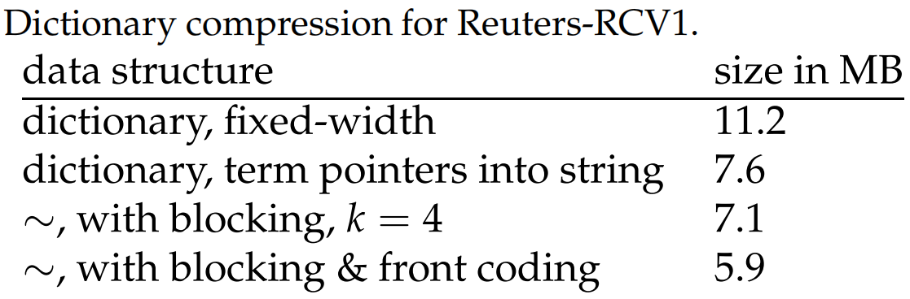

倒排记录表的大小要远远大于词典的大小。常用的倒排记录表压缩方法有**可变字节码**(利用整数个字节来对间距编码)以及$\gamma$编码等。

### 1.5 文档评分、词项权重计算以及向量空间模型

在文档集规模很大的情况下，满足布尔查询的结果文档数量可能非常多，往往会大大超过用户能够浏览的文档的数目。因此，对于搜索引擎来说，对文档进行评分和排序非常重要。目前可以认为，如果文档中的词项出现的频率越高，那么该文档的得分也越高。

首先，对于词项$t$，根据其在文档$d$中的权重来计算它的得分。最简单的方式是将权重设置为$t$在文档中的出现次数。这种权重计算的结果称为**词项频率(term frequency)**，记为$\text{tf}_{t, d}$。

原始的词项频率的计算中，所有词项都被认为是等同重要的。但实际上，某些词项对于相关度的计算几乎没有或很少有区分能力。例如，在一个有关汽车工业的文档集中，几乎所有的文档都会包含auto，此时，auto就没有区分能力。一个很直接的想法就是给**文档集频率(collection frequency)**较高的词项赋予较低的权重，文档集频率指的是词项在文档集中出现的次数。这样便可以减低具有较高文档集频率的词项的权重。通常使用逆文档频率：
$$
\text{idf}_t=\lg \frac{N}{\text{df}_t}
$$

其中，$N$为文档的数目，$\text{df}_t$为出现词项$t$的所有文档的数目(**文档集频率**)。对于每篇文档中每个词项，可以将其$\text{tf}$和$\text{idf}$组合起形成最终的权重：$\text{tf-idf}_{t,d}=\text{tf}_{t,d} \times \text{idf}_t$。这样，就可以**把文档看成一个向量**，其中每个分量都对应词典中一个词项的$\text{tf-idf}$值。这种向量形式对于评分和排序十分重要，最简单的评分是重合度评分指标，即文档$d$的得分是所有查询词项在文档中出现次数的$\text{tf-idf}$之和：
$$
\operatorname{Score}(q, d)=\sum_{t \in q} \text {tf-idf}_{t, d}
$$
一系列文档在同一向量空间中的表示被称为**向量空间模型(vector space model, VSM)**，它是信息检索领域一系列相关处理的基础，比如文档的评分、文档的分类及聚类等。

在向量空间模型中，两篇文档的相似度可以使用**余弦相似度(cosine similarity)**进行计算：
$$
\operatorname{sim}(d_{1}, d_{2})=\frac{\vec{V}(d_{1}) \cdot \vec{V}(d_{2})}{|\vec{V}(d_{1})||\vec{V}(d_{2})|}
$$
计算两篇文档的相似度有很大的作用。例如，如果在某个系统中，用户先确定一篇文档然后查找与之相似的文档(**类似网页**)，相似度便能提供帮助。

将文档表示成向量的一个令人信服的理由是也可以**将查询表示成向量**。概括来说，只要将查询看成词袋，那么就能将它当成一篇极短的文档来处理。因此，通过计算给定查询向量和每个文档向量的相似度来对所有文档进行排名，最终的结果可以用于选择排名靠前的一些文档。查询和文档的相似度也可使用余弦相似度进行计算。

### 1.6 一个完整搜索系统中的评分计算

#### 1.6.1 快速评分及排序

用户输入查询字符串，当搜索引擎计算出满足条件的文档的得分以后，最后一步就是选出得分最高的$K$篇文档呈现给用户。尽管可以先对上述所有得分**进行排序**然后再挑选前$K$个结果，但是一个更好的方法是通过某种**堆结构**只返回前$K$篇文档。这种做法是精确返回前$K$篇文档的方法，但是在某些应用场景下，**非精确返回**前$K$篇文档的方法能够显著降低计算复杂度，同时并不让用户感觉到前$K$个结果的相关度有所降低。

这类非精确方法通常包含两步：(1) 找到一个文档集合$A$，它包含了参与最后的**候选文档**，$A$中文档的数量大于$K$且远小于$N$(文档集中的**文档总数**)。$A$不必包含前$K$篇得分最高的文档，但它应该包含很多和前$K$篇文档**得分相近的文档**。(2) 返回$A$中得分最高的$K$篇文档。

常用的非精确返回前K篇文档的方法包括**索引去除技术**、**胜者表(champion list)**、**静态质量得分(static quality score)**、**影响度排序**、**簇剪枝方法(cluster pruning)**等。

向量空间模型一般只在自由文本查询，而无法支持查询操作符(如布尔运算符、通配符和短语查询等)。对于布尔查询，数学领域实际上存在一种称为**p范式(p-norm)**的方法，可用于融合布尔和向量空间查询，但**目前还没有实际系统这样做**；对于通配符查询，可以**将通配符解释为向量空间模型汇总的一系列查询词项(比如将rom*解释为rome和roman等一系列可能的词项)**，然后将所有查询词项加入到查询向量中去；对于短语查询，**用于向量空间方法的索引通常并不能用于短语查询的处理**。

#### 1.6.2 信息检索系统的组成

到目前为止，我们考察了一个能够支持自由文本查询、布尔查询、域查询以及字段查询的基本搜索系统所需要的各个部件。下图展示了该搜索系统的架构图：

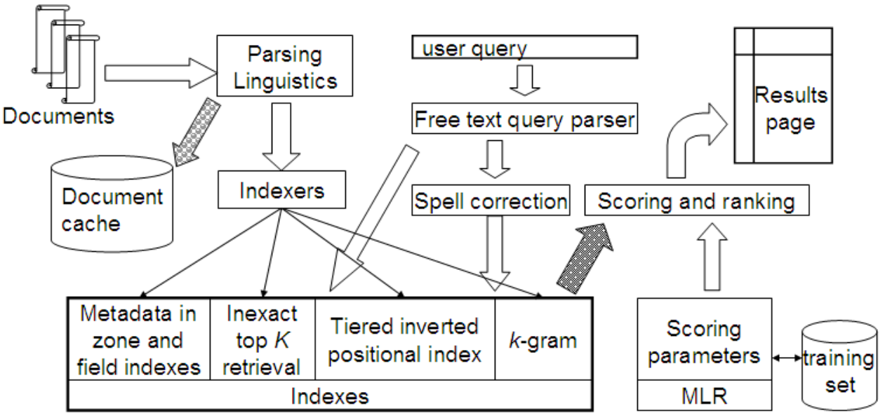

文档不断从左边流入到**分析和语言处理模块**(语种识别、格式识别、词条化及词干还原等)，处理所输出的结果词条序列又会输送给两个后续模块：首先，**文档缓存**中保留了每个分析过的文档，用于产生结果摘要片段。所有词条的另一个副本则输入到一系列**索引器**中，从而产生一系列索引结构。自由文本查询输送给索引器，并二模块产生拼写校正后的候选查询。返回的文档输送给**评分模块**，该模块**通过机器学习方法进行计算**，将排序文档返回给用户。

### 1.7 信息检索的评价

#### 1.7.1 测试集

采用常规的方式来度量ad hoc IR系统的效果，需要一个**测试集(test collection)**，它由**一个文档集、一组用于测试的信息需求集合以及一组相关性判定结果**三部分组成。对每个查询-文档对而言，通常会赋予一个二值判断结果，即**相关(relevant)和不相关(nonrelevant)**。常规的IR系统评价方法主要围绕相关和不相关文档的概念来开展。对于每个用户信息需求(查询)，将测试集中的每篇文档的相关性判定看成一个**二分类问题**进行处理。这些判定结果称为相关性判定的**黄金标准**或**绝对真理(ground truth)**。

测试集中的文档及信息需求的数目必须要合理：因为在不同的文档集合信息需求上的结果差异较大，所以需要在相对较大的测试集合上对不同信息需求的结果求平均。经验表明，50条信息需求基本足够。

需要指出的是，**相关性判定是基于信息需求而不是基于查询来进行的**。要评价一个系统，需要对信息需求进行显式的表达，以便利用它对返回的文档进行相关性判定。

许多系统都包含多个权重参数，改变这些参数能够调优系统的性能。**通过调优参数而在测试集上获得最佳性能并报告该结果是不可取的。这是因为这种调节能在特定的查询集上获得最佳参数，而这些参数在随机给定的查询集上并不一定能够获得最佳性能**。正确的做法是，给定一个或者多个**开发测试集(development test collection)**，在这个开发测试集上调节参数直至最佳性能，然后测试者再将这些参数应用到最后的的测试集上，最后再改测试集上得到的结果性能才是真实性能的无偏估计结果。

#### 1.7.2 无序检索结果的评价方法

对于无序检索结果的评价，**精准率(precision)**和**召回率(recall)**以及二者的调和平均值F值是常用的评价指标。由于信息检索中的数据存在着极度的不均衡性(超过99.9%的文档都是不相关文档)，**分类准确度(accuracy)通常不能够作为一个良好的评价指标**，因为一个简单地将所有的文档都判成不相关文档的系统就会获得很高的分类准确度。

一个融合了精准率和召回率的指标是F值(F measure)，它是精准率P和召回率R的调和平均值，定义如下：
$$
F=\frac{1}{\alpha \frac{1}{P}+(1-\alpha) \frac{1}{R}}=\frac{(\beta^2+1)PR}{\beta^2P+R}
$$
其中，$\beta^2=(1-\alpha)/\alpha$，$P$为精准率，$R$为召回率。默认情况下，**平衡F值(balanced F measure)**中精准率和召回率的权重相等，即$\alpha=1/2$或$\beta=1$，记为$F_1$。这种情况下，F的计算公式可以简化为：
$$
F_1=\frac{2PR}{P+R}
$$
然而，等权重取值并不是唯一选择。$\beta < 1$表示强调精准率，而$\beta > 1$表示强调召回率。

为什么使用调和平均而不是其他平均方法(如算术平均)来计算F值呢？若通过返回所有文档来获得100%的召回率，此时**如果采用算术平均来计算F值，那F值至少为50%**。这表明在这里使用算术平均显然是不合适的。而如果采用调和平均来计算，假定10,000篇文档中只有1篇和查询相关，那么此时F值为0.02%。调和平均值小于等于算术平均值和几何平均值。**如果两个求平均的数之间相差较大，那么和算术平均值相比，调和平均值更接近其中的较小值**。

#### 1.7.3 有序检索结果的评价方法

当面对诸如搜索引擎等系统输出的有序检索结果时，很自然地会将前面$k$个($k=1,2,\cdots$)检索结果组成合适的返回文档子集。**对每个这样的集合，都可以得到精准率和召回率**，分别以其横纵坐标在平面上描点并连接并可以得到**精准率-召回率曲线(PRC)**，如下图所示：

精准率-召回率曲线往往会表现出明显的锯齿形状，这是因为如果放回的第$k+1$篇文档不相关，那么在$k+1$篇文档位置上的召回率和前$k$篇文档位置上的召回率一样，但是精准率显然下降。反之，如果返回的第$k+1$篇文档相关，那么精准率和召回率都会增大，此时曲线又呈锯齿形上升。将这些细微的变化去掉往往非常有用，实现这一目的的常规方法是采用插值的正确率。可以将这些点按照**召回率为0.0, 0.1, 0.2**等11个点对应的精准率进行描述，称为**11点插值平均精准率(eleven-point interpolated average precision)**。如下图所示：

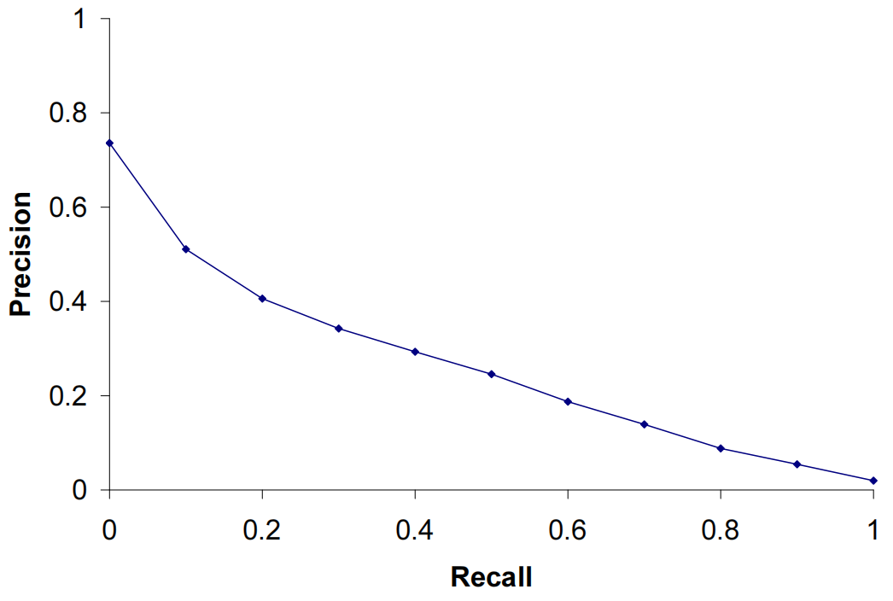

近年来，一些其他的评价指标使用越来越普遍。**TREC(文本检索会议)**中最常规的指标是**MAP(mean average precision, 平均精准率均值)**，它可以在每个召回率水平上提供单指标结果。在众多评价指标中，MAP被证明具有非常好的**区别性(discrimination)**和**稳定性(stability)**。对于单个信息需求，返回结果中在每篇相关文档位置上的精准率的平均值被称为平均精准率(average precision)，然后将所有信息需求平均即可得到MAP。形式化地，假定信息需求$q_j \in Q$对应的所有相关文档集合为$\{d_1,\cdots,d_{mj}\}$，$R_{jk}$是返回结果中直到遇见$d_k$后其所在位置前(含$d_k$)的所有文档集合，则有：
$$
\text{MAP}(Q)=\frac{1}{|Q|}\sum_{j=1}^{|Q|}\frac{1}{m_j}\text{Precision}(R_{jk})
$$

如果某篇相关文档未返回，那么上式中其对应的精准率的值为0。**对于单个信息需求来说，平均精准率是未插值的精准率-召回率曲线下的面积的近似值**，因此，**MAP可以粗略地认为是某个查询集合对应的多条精准率-召回率曲线下面积的平均值**。

上述指标实际是在所有的召回率水平上计算正确率。对于许多重要应用特别是Web搜索来说，该指标对于用户而言作用并不大，它们看重的是在第一页或前三页中有多少好结果。于是需要在固定的较少数目(如10篇文档)的结果文档中计算精准率，称为前$k$个结果的精准率，记为$P@k$。

**CG(cumulative gain, 累积增益)**是近年来一种逐渐被采用的，往往应用在**基于机器学习的排序方法**中的指标，一个具体的指标为**NDCG(normalized discounted cumulative gain, 归一化折损累积增益)**：
$$
\operatorname{NDCG}(Q, k)=\frac{1}{|Q|} \sum_{j=1}^{|Q|} Z_{k j} \sum_{m=1}^{k} \frac{2^{R(j, m)}-1}{\log _{2}(1+m)}
$$
其中$Q$是查询集合，$R(j,d)$是评价人员给出的文档$d$对查询$j$的相关性得分，$Z_{j,k}$是归一化因子，用于保证对于查询$j$最完美系统的$\text{NDCG@k}$得分为1，$m$是返回文档的位置。如果某查询返回的文档数$k'<k$，那么上述公式中主序要计算到$k'$为止。

### 1.8 相关反馈及查询扩展

在大多数文档集中，同一概念可以用不同的词来表达，这个现象称为**一义多词(synonymy)**。**相关反馈(relevance feedback, RF)**的主要思想是，在信息检索的过程中**通过用户交互来提高最终的检索结果**。具体来说，用户会对检索结果的相关性给出反馈意见，其基本的过程包括如下几点：(1) 用户提交一个简短的查询；(2) 系统返回**初次检索结果**；(3) 用户对部分结果进行**标注**，将它们标注为相关或不相关；(4) 系统基于用户的反馈计算出一个**更好的查询**(而**不是直接更改结果**)来表示信息需求；(5) 利用新查询返回新的检索结果。

**Rocchio算法**是相关反馈实现中的一个经典算法，它提供了一种通过修改向量权重将相关反馈信息融入到向量空间模型的方法。假设我们要找一个最优的查询向量$q$，它与相关文档之间的相似度最大且同时又和不相关文档之间的相似度最小。若$C_r$表示相关文档集，$C_{nr}$表示不相关文档集，那么我们希望找到的最优的$q$是：
$$
\vec{q}_{o p t}=\underset{\vec{q}}{\arg \max }[\operatorname{sim}(\vec{q}, C_{r})-\operatorname{sim}(\vec{q}, C_{n r})]
$$
采用余弦相似度计算时，最优向量为：
$$
\vec{q}_{o p t}=\frac{1}{|C_{r}|} \sum_{\vec{d}_{j} \in C_{r}} \vec{d}_{j}-\frac{1}{|C_{n r}|} \sum_{\vec{d}_{j} \in C_{n r}} \vec{d}_{j}
$$
这就是说，最优的查询向量等于相关文档的质心向量和不相关文档的质心向量的差。Rocchio算法提出，在一个真实的信息检索场景中，假定我们有一个用户查询，并且知道部分相关文档和不相关文档的信息，则可以通过如下公式得到修改后的查询向量$q_m$：

$$
\vec{q}_{m}=\alpha \vec{q}_{0}+\beta \frac{1}{|D_{r}|} \sum_{\vec{d}_{j} \in D_{r}} \vec{d}_{j}-\gamma \frac{1}{|D_{n r}|} \sum_{\vec{d}_{j} \in D_{n r}} \vec{d}_{j}
$$
其中，$q_0$是原始的查询向量，$D_r$和$D_{nr}$是已知的相关和不相关文档集合，$\beta$后面的因子和$\gamma$后面的因子分别是$D_r$和$D_{nr}$的质心向量。$\alpha$，$\beta$和$\gamma$是上述三个向量的权重。这些权重能控制判定结果和原始查询向量之间的平衡：如果存在大量已判定文档，那么会给和赋予较高的权重。修改后的新查询从$q_0$开始，向着相关文档的质心靠近了一段距离，而同时又离不相关文档的质心远离了一段距离。通常一个合理的参数取值是：$\alpha=1$，$\beta=0.75$，$\gamma=0.15$。

**伪相关反馈(pseudo relevance)**提供了一种自动局部分析的方法。它将相关反馈的人工操作部分自动化，因此用户不需要进行额外的交互就可以获得检索性能的提升。该方法首先进行正常的检索过程，返回最相关的文档构成初始集，然后假设排名靠前的k篇文档是相关的，最后在此假设上像以往一样进行相关反馈。

在**查询扩展(query expansion)**中，用户会对查询词或短语给出额外输入信息，比如可能推荐额外的查询词项。一些搜索引擎特别是Web搜索引擎会给出相关的推荐查询，然后用户可以选择其中的**某个推荐查询**进行搜索。这种形式的查询扩展的核心问题是**如何生成或者扩展出新的查询**。最普遍的方法是通过某种形式的同义词词典进行全局分析。

### 1.9 概率检索模型

概率检索模型是一种估计查询表示和文档表示之间相关程度的一种方法。一个排序是检索系统所需要的基本配置有：文档集、用户输入的查询以及返回的有序文档结果。**假设相关度是二值的(即相关为1，不相关为0)**，对查询$q$和文档集中的一篇文档$d$，假定变量$R_{d,q}$代表$d$和$q$是否相关。可以利用概率模型来估计每篇文档和需求(查询)的相关概率$P(R|d,q)$，然后对结果进行排序，这便是**概率排序原理(probability ranking principle, PRP)**。

在信息检索领域，一个常用的概率概念是事件的**优势率(odds)**。对于事件$A$，其优势率为：
$$
O(A)=\frac{P(A)}{P(\bar A)}=\frac{P(A)}{1-P(A)}
$$
**二值独立模型(binary independence model, BIM)**引入一些简单的假设来对概率函数$P(R|d,q)$进行估计。首先，二值指文档和查询都表示为词项出现与否的布尔向量。也就是说，文档$d$表示为向量$x=(x_1,x_2,\cdots,x_M)$，其中当词项$t$出现在文档$d$中时，$x_t=1$；否则$x_t=0$。类似地，我们将查询$q$也表示为以上形式。

“独立性”指的是词项在文档中的出现是相互独立的，即朴素贝叶斯中的**条件独立假设**。本质上说，**二值独立模型就是多元伯努利朴素贝叶斯模型**。

给定查询$q$，二值独立模型按照$P(R=1|x, q)$从高到低将所有文档排序。检索系统关心的只是文档的相对次序，所以并不需要直接估计出这个概率值，而是采用其他更容易计算的排序函数，这中间只需要**保证排序函数和直接计算概率所得到的文档次序一致**即可。具体地，可以根据文档相关性的优势率来对文档排序，它是相关性概率的单调递增函数：
$$
O(R | x, q)=\frac{P(R=1 | x, q)}{P(R=0 | x, q)}=\frac{\frac{P(R=1 | q) P(x | R=1, q)}{P(x | q)}}{\frac{P(R=0 | q) P(x | R=0, q)}{P(x | q)}}=\frac{P(R=1 | q)}{P(R=0 | q)} \cdot \frac{P(x | R=1, q)}{P(x | R=0, q)}
$$

对于给定查询来说，$\frac{P(R=1 | q)}{P(R=0 | q)}$是个常数。由于我们只关注文档排序，因此没有必要估计这个常数。因此，只需要估计$\frac{P(x | R=1, q)}{P(x | R=0, q)}$，但是这个问题很难，因为要精确估计整个词项向量的概率。因此，这里引入朴素贝叶斯条件独立性假设，即在给定查询的情况下，认为在文档中一个词出现与否与任意一个其他词的出现与否相互独立，即：
$$
\frac{P(x | R=1, q)}{P(x | R=0, q)} = \prod_{t=1}^M \frac{P(x_t | R=1, q)}{P(x_t | R=0, q)}
$$
因此有
$$
O(R|x, q)=O(R|q) \cdot \prod_{t=1}^M \frac{P(x_t | R=1, q)}{P(x_t | R=0, q)}
$$
由于每个$x_t$的取值要么为0，要么为1，所以有
$$
O(R|x, q)=O(R|q) \cdot \prod_{t:x_t=1} \frac{P(x_t=1 | R=1, q)}{P(x_t=1 | R=0, q)} \cdot \prod_{t:x_t=0} \frac{P(x_t=0 | R=1, q)}{P(x_t=0 | R=0, q)}
$$
记$p_t=P(x_t=1|R=1,q)$，即词项$x_t$出现在一篇相关文档中的概率；同样令$u_t=P(x_t=1|R=0,q)$，即词项出现在一篇不相关文档中的概率。BIM模型通过估计这两个概率，对文档进行排序。

### 1.10 基于语言建模的信息检索模型

**语言模型(language model, LM)**是求解词项(字符串)序列生成的概率的统计语言模型。将统计语言模型应用于信息检索领域的大部分工作都只使用了一元语言模型，因为IR并不是一个必须使用复杂语言模型的领域，它并不像语音能识别等应用那样直接依赖于句子的结构。

#### 1.10.1 查询似然模型

信息检索领域最早使用的语言模型是**查询似然模型(query likelihood model)**，在这个模型中，对文档集中的每篇文档$d$构建起对应的语言模型$M_d$。检索的目标是将文档按照其与查询相关的概率$P(d|q)$排序。根据贝叶斯公式，有$P(d|q)=P(q|d)P(d)/P(q)$。其中，$P(q)$对所有文档都一样，因此可以被忽略；文档的先验概率$P(d)$往往可以视为均匀分布，因此也可以被省略。检索结果按照查询似然$P(q|d)$进行排序，它是在文档$d$对应的语言模型下生成$q$的概率。因此，IR中的语言建模方法实际上是在对查询的生成过程进行建模：首先每篇文档对应一个文档模型，然后计算查询被视为每个文档模型的随机抽样样本的概率，最后根据这些概率对文档排序。

最普遍的计算$P(d|q)$的方法是使用多项式一元语言模型。该模型等价于多项式朴素贝叶斯模型：
$$
P(q | M_{d})=K_{q} \prod_{t \in V} P(t | M_{d})^{\mathrm{tf}_{t, d}}
$$
其中$K_q$为查询$q$的多项式系数。对于某个特定的查询，它是一个常数，因此可以被忽略。在基于语言模型的检索中，可以将查询的生成看成一个随机过程，具体方法是：(1) 对每篇文档推导出其LM；(2) 估计查询在每个文档的LM下的生成概率；(3) 按照上述概率对文档进行排序。

概率$P(q|M_d)$可以使用最大似然估计进行估计：
$$
\hat{P}(q|M_{d})=\prod_{t \in q} \hat{P}_{\mathrm{mle}}(t | M_{d})=\prod_{t \in q} \frac{\mathrm{tf}_{t, d}}{L_{d}}
$$

### 参考资料

[1] Christopher Manning, et. al. 信息检索导论. 北京: 人民邮电出版社, 2019.