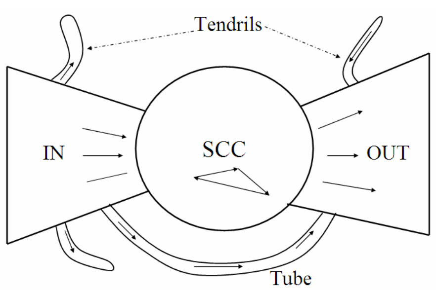
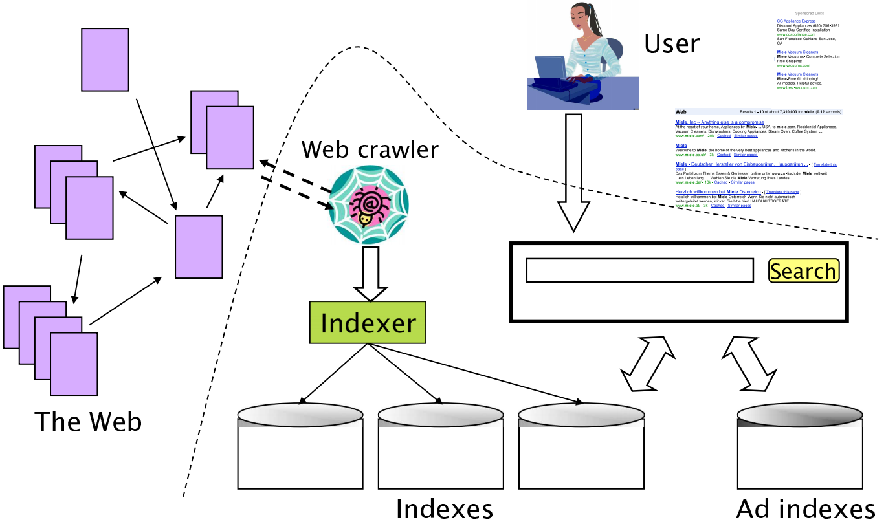
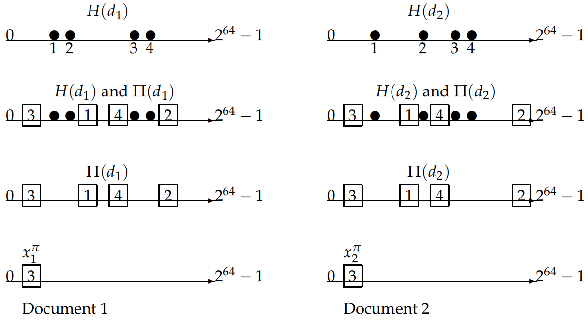
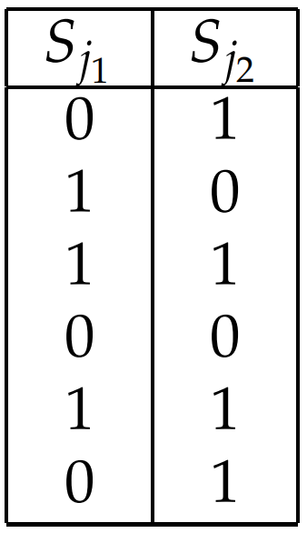
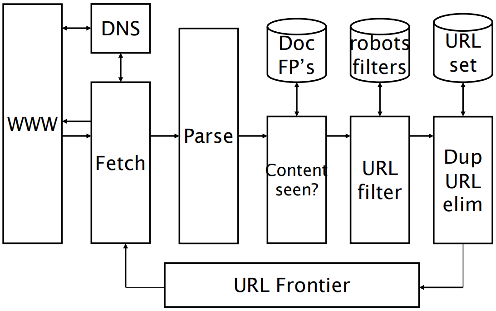
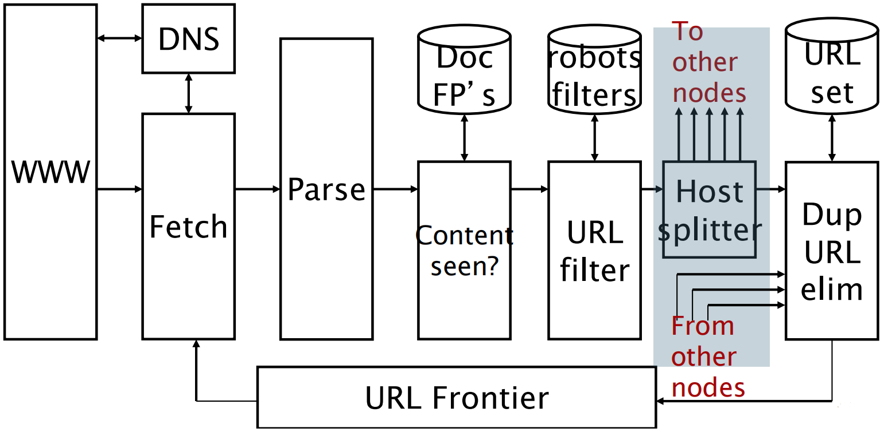

## 信息检索2 Web搜索

### 2.1 背景和历史

Web在很多方面都是空前的：不仅在**规模**上史无前例，而且其创建过程中**协调机制**的缺乏也是空前的；另外，Web**参与者的背景和动机**的多样性同样也是空前的。以上每一个因素都使得Web搜索有区别于传统的文档搜索，并且，**一般来说Web搜索要困难得多**。

Web的使用往往基于一个简单的客户端-服务器机制就可以实现：(1) 服务器通过某个**轻量级的协议(如HTTP)**和客户端通信，该协议是异步的，并且可携带各种内容(开始是文本、图像，后来随着时间的推移出现了更丰富的视频、音频等媒体)，这些媒体通过一个简单的HTML标记语言进行编码；(2) 客户端通常是**浏览器**，即一个具有图形用户环境的应用。上述这些看上去并不起眼的特征对Web的增长居功至伟。

如果其他用户不能发现并使用Web上发布的大量信息，那么这些信息实际上就毫无价值。有关Web信息发现的早期尝试可以归为两类：(1) 像AltaVista、Excite和InfoSeek一样的**基于全文索引的搜索引擎**；(2) 诸如Yahoo的Web**网页分类体系**。前者在前台给用户提供了**关键词搜索界面**，而在后台则采用**倒排索引和排序机制**。后者可以允许用户沿**树形结构的类别体系**进行浏览。然而将网页精确地分类到层次树结点上需要大量人工操作，因此很难拓展，最终逐渐被淘汰。

第一代Web搜索引擎将传统的搜索技术应用到Web领域，它们主要关注**规模上的挑战性**。要完成大规模的索引、查询和排序，需要利用数十台计算机来建立一个具有高可靠性的系统。第一代Web搜索引擎针对上述挑战取得了巨大的成功，它们能够持续索引很大一部分Web页面，并且能在亚秒级时间内完成对查询的应答。但由于Web内容的特殊性，Web搜索结果的**质量和相关性**离期望还有很大的距离，这就亟需研发新的**排序机制**和**反作弊技术**来提高搜索质量。例如，传统IR技术只考虑文档和查询的相关性，而Web搜索必须考虑文档的**权威度**。

### 2.2 Web的特性

导致Web爆炸式增长的最根本原因在于**无法集中控制的无中心网页内容发布机制**。由于Web发布现在已经对数千万用户开放，网页在其规模惊人增长的同时也在很多重要方面表现出不同的特点：(1) 内容创作不再是少数受过编辑培训的作家的特权，尽管这意味着内容创作的极大**民主化**，但同时也造成网页中存在大量语法和风格上的巨大差异。(2) 在任何一个话题上都会出现一些粒度更细的不同观点，这表示Web中包含**真理、谎言、矛盾和大量猜测**。

“Web到底有多大”这个问题不易回答，另一个问法“某个搜索引擎中索引的网页数目是多少”比较精确，当然，回答这个问题也并不容易。到1995年底，AltaVista声称它采集并索引了大概3000万个静态网页。所谓**静态网页(static web page)**，指的是那些**内容不会因请求不同而不同的网页**。按照这个定义，一个教授每周都会手工修改的网页是静态网页，而机场航班状态页面一般是动态的。**动态网页(dynamic web page)**通常是由应用服务器应答数据库的查询需求时产生的。**如今的网页大多都是动态网页**。

#### 2.2.1 Web图

可以将整个静态Web看成是静态HTML网页通过超链接相互连接而形成的有向图，其中每个**网页是图的顶点**，而每个**超链接则代表一个有向边**。该有向图可能不是一个连通图，且这些链接并不满足随机分布。一方面，如果每个网页都是随机均匀地选择链接目标时，那么链接到一个网页的链接数目应该满足泊松分布，但是实际中的数目并不满足预想的泊松分布。大量研究表明这个分布满足**幂分布定律**，入度为$i$的网页的总数目正比于$1/i^α$。

另外，一些研究表明，整个Web有向图的结构是个**蝴蝶结形**，其中主要包含三大类网页，分别是IN、OUT和SCC。**Web冲浪者能从IN中任一网页出发通过超链接到达SCC的任一网页，同样可以从SCC任一网页出发到达OUT任一网页，最后，SCC中的任一网页可以到达SCC中的其他网页。然而，不可能从SCC中的网页到达IN的任一网页，也不能从OUT中的网页到达SCC/IN中的任一网页**。

值得注意的是，在一些研究中，IN和OUT的规模大致相当，而SCC的规模则稍大。大部分网页都落入到这三大类中，剩余的网页构成了所谓的**管道(tube)**，它由少部分SCC之外的网页组成，可以直接将IN和OUT中的网页相连。另外，还有一些不能从IN到达OUT的网页构成的**卷须(tendril)**。下图给出了Web图的这种结构：

#### 2.2.2 作弊网页

在早期的Web搜索历史上，Web搜索引擎显然是连接广告商和顾客的一种重要途径。在一个基于词项频率排名的搜索引擎中，一个反复出现用户搜索关键词的网页排名将会很高，这导致了第一代**作弊网页(spam)**的产生，即**通过操作网页内容来达到在某些关键词的搜索结果中排名较高的目的**。为了避免用户对这些冗余和重复信息的极度反感，一些老练的作弊者还会采用一些手段和技巧，比如**将这些重复的词设置成和背景一样的颜色**。

从根本上说，网页作弊起源于网页内容建设动机的多样性，而最大的动机就是通过搜索引擎的结果来获益。在很多Web搜索引擎中，有可能可以通过付费来讲自己的网页放入到搜索引擎的索引中，这个模型称为**付费收录(paid inclusion)**。对于是否允许付费收录、付费是否会影响搜索引擎的排名结果，不同的搜索引擎会有不同的政策。

针对作弊技术，搜索引擎也很快变得更加成熟。为此，作弊者也发展出更多的作弊技术。第一种技术被称为**伪装(cloaking)**：根据HTTP请求是来自搜索引擎的采集器还是用户所使用的的浏览器，作弊Web服务器会返回不同的网页结果。如果是前者，那么会返回一个包含欺骗性关键词的作弊网页供搜索引擎索引。这样，当用户输入这些关键词并选择该网页进行浏览时，他看到的却是与搜索引擎索引的内容不同的另一个网页。这种对搜索引擎索引器的欺骗在传统IR中是没有的，它主要是由于网页发布者和搜索引擎之间的不完全协作而造成的。

作弊者和搜索引擎的抗争产生了一个新的研究领域：**对抗式信息检索(adversarial information retrieval)**。为了对抗作弊者，人们开发出了一种利用Web中链接结构的被称为**链接分析**的方法，目前已知最早使用链接分析的搜索引擎是Google，其标志性算法是**PageRank**。

### 2.3 广告经济模型

在Web发展的早期，公司会将图形化的广告横幅放在流行的网站上。这些广告的主要目的是品牌推广(branding)。通常，这些广告是按照**CPM(cost per mil, 每千次显示付费)机制付费**，即横幅广告显示1000次为一次付费单位。

某些网站和广告客户之间还采用**CPC(cost per click, 每次点击付费)**机制进行广告收费，在这里，广告的目的就不是品牌推广而是**促进交易**了。

采用CPC机制的先驱是一个名叫Goto的公司，对于每个查询项$q$，它会接受那些期望将网页与$q$进行关联的公司的竞标。为应答查询$q$，Goto会返回所有投标广告商的网页结果，并**按照他们的投标价格进行排序**。此外，**当用户点击某个返回结果时，相应的广告商会付费给Goto**。

这种模式的搜索引擎在后来被称为**赞助搜索(sponsored search)**或**搜索广告(search advertising)**。

给定两种搜索引擎，一种是类似Google的纯搜索引擎，另一种是赞助搜索引擎。一个很自然的步骤就是将它们合并到统一的用户体验中。现有的搜索引擎基本都是按如下模式：对于用户的查询，搜索引擎会将“纯”搜索结果作为主要结果返回给用户，同时**赞助搜索结果在算法结果的右侧独立并有区别性地显示出来**。

赞助搜索背后锁固有的经济利益也驱使一些人为达到自己的目的来暗中破坏系统。有很多种破坏形式，其中一种被称为**垃圾点击(click spam)**，比如一个心术不正的广告商可能会试图通过**重复点击其竞争者的赞助搜索广告来耗尽其广告预算**。

### 2.4 搜索用户体验

传统IR中的用户通常至少是**受过查询措辞训练的专业人士**，并且他们查询的文档库通常也是良好的创作结果，其风格和结构都很容易被用户所理解。而Web则体现出明显的不同，**Web搜索用户往往不知道或者根本不关心Web内容的多样性、查询语言的语法以及查询的措辞手法**。一系列研究结果表明，Web搜索中的平均查询关键词个数大概是2到3个，并且**用户很少使用语法操作符(布尔连接符、通配符等)**。

很显然，搜索引擎吸引的用户流量越大，那么从赞助搜索中获得的利润也就更多。Google确定了两个帮助自己流量增长同时使竞争者流量下降的原则：(1) 关注相关性，特别是**排名靠前的一些结果的precision而不是recall**；(2) **用户体验要轻量级**，也就是说查询页面和返回结果页面应简洁整齐。第一个原则可以帮助用户减少信息定位的时间，第二条原则能够保证用户得到飞快的用户体验，或者说载入查询页面或者结果页面都不会成为瓶颈。

普通的Web搜索查询似乎可以分成三大类：(1) **信息类(informational)查询**：主要查找的是与某个宽泛主题相关的一般信息。实际上，用户输入信息类查询的目的往往是**从多个不同网页中抽取信息**。(2) **导航类(navigational)查询**：查找的是用户心目中某个实体的网站或者主页。(3) **事务类(transactional)查询**：是用户在Web上进行事务处理的一个前导查询，这些事务包括产品购买、文件下载或进行预订等。

将查询分到上述几类中也是一个挑战性问题。类别信息不仅可以用于控制基于算法的搜索结果，也可以用于查询和赞助搜索结果的匹配当中(由于查询可能表示出购买意图)。**对于导航类查询，有些人认为搜索引擎应该仅仅返回一条结果记录甚至是直接返回目标页面**。然而，历史上很多Web搜索引擎都参与了索引量大小的竞争，大家都鼓吹自己的索引量比其他搜索引擎大，但是用户似乎并不关注索引量大小。然而，媒体忘完突出不同搜索引擎大小的估计结果(这些结果往往在统计上站不住脚)，用户很容易受到这些报道的影响，因此，搜索引擎必须要重视自己及其竞争者的索引量大小。对于信息类查询(以及在一定程度上也包括事务类检索)，用户确实关系搜索引擎的覆盖面。

下图给出了一个**Web搜索引擎的组成示意图**，包括采集器、网页索引及广告索引。虚线下面的部分属于搜索引擎的内部结构。

### 2.5 索引规模及其估计

尽管由于有些网页包含的信息量更大，搜索引擎具体索引了哪些网页至关重要，然而**初步估计的话，可以说索引规模越大，搜索引擎的覆盖面也越大**。估计出某个搜索引擎的索引规模占整个Web的比例是非常困难的，这是因为**Web中存在无数的动态网页**。

一个具有更好定义的问题如下：给定两个搜索引擎，它们索引的相对规模如何。当然，这个问题也是不精确的。尽管如此，研究人员仍然设计出不少方法来粗略估计两个搜索引擎$E_1$和$E_2$的索引规模的相对比值。这些技术的背后是一些基本假设：(1) Web的规模是有限的，每个搜索引擎都从中选择了一个子集；(2) 每个搜索引擎都从Web中独立、均匀地选择了部分网页子集。然而，上述假设与实际情况相差太远。但是，如果基于这些假设，就可以采用一种被称为**捕获再捕获(capture-recapture method)**的传统技术来进行估计：

假定我们从$E_1$的索引中随机选取一个网页，并检验它是否属于$E_2$。同样也可以检验某个从$E_2$中随机选取的网页是否属于$E_1$。根据上述实验，可以得到两个分数$x$和$y$，其中$x$表示从$E_1$中抽出的网页属于$E_2$的比例，$y$表示从$E_2$中抽出的网页属于$E_1$的比例。因此，假定搜索引擎$E_i$的规模用$|E_i|$来表示的话，那么有$x|E_1| \approx y|E_2|$。

上式进一步可以写成如下形式：
$$
\frac{|E_1|}{|E_2|}=\frac{y}{x}
$$

### 2.6 近似重复及搭叠

Web网页的**重复(duplication)**问题指的是Web上包含了大量具有相同内容的重复网页。有估计认为，**Web中大概有40%的网页和其他网页重复**。

检测重复最简单的方法就是为每个网页计算出一个**指纹(fingerprint)**，它是整个网页文本的一个**很精炼的摘要**。然后，一旦发现两篇文档的指纹一样，就可以检查这两篇文档是否真的相同。如果相同，就认为其中一篇是另一篇的副本。但是，在面对Web上另一个更广泛的被称为**近似重复(near duplication)**的现象时，上述的简单方法却并不成功。近似重复指的是两个网页**并不完全相同，而是在某些字符上有点差异**，比如两个网站仅仅是最后的**更新日期不同**。在这种情况下，网页的重复度也是很高的，因此我们希望只索引一份网页。

**搭叠(shingling)**技术是近似重复的解决方案之一。给定正整数$k$以及文档$d$的一个词项序列，可以定义文档$d$的$k-shingle$为$d$中所有$k$个连续词项构成的序列。例如，考虑文档“a rose is a rose is a rose”，它的$4-shingle$(在近似重复检测中，$k=4$是一个常用值)为“a rose is a”，“rose is a rose”以及“is a rose is”，前两个$4-shingle$在文本中都出现两次。直观上看，如果两个文档的搭叠块集合几乎一样，那它们就满足近似重复。

要计算两个文档的相似性，首先取出二者**搭叠块的集合**$S(d_1)$和$S(d_2)$，然后**计算两个集合之间的Jaccard系数**，其计算公式为$J(S(d_1),S(d_2)=|S(d_1) \cap S(d_2)|/|S(d_1) \cup S(d_2)|$，即二者交集的大小除以二者并集的大小。若Jaccard系数超过某个预先给定的**阈值(比如0.9)**，那么就可以认为它们是近似文档，在索引时就会去掉其中一篇文档。然而，这种方式需要极大的计算量，因为要计算两两文档间的Jaccard系数。

为解决该问题，使用某种哈希的形式：

首先，将所有搭叠块都映射到一个大空间(比如64位)下的哈希值。令$H(d_j)$表示文档$d_j$中的搭叠块映射出的64位的哈希值集合，其中$j=1,2$。下面将采用一个技巧来检测出那些文档对的$H()$集合之间具有较大的Jaccard重叠度。

令$\pi$为从64位整数到64位整数的一个**随机置换(将集合对象随机排序的过程，比如整数集合{1, 2, 3, 4, 5}的一个随机置换可能是{3, 2, 1, 5, 4})**。$H(d_j)$中所有哈希值的置换结果集合记为$\Pi(d_j)$，因此对每个$h \in H(d_j)$，都存在一个相应值$\pi(h) \in \Pi(d_j)$。令$x_j^\pi$为$\Pi(d_j)$中**最小的整数**，于是有如下定理：
$$
J(S(d_1),S(d_2))=P(x_1^\pi=x_2^\pi)
$$
证明：下面给出一个更一般情况下的证明。考虑一系列集合，它们的元素均来自同一个论域。我们将这些集合看成一个矩阵$A$的列，这个**矩阵的每一行都对应论域的一个元素**。矩阵元素$a_{ij}=1$表示元素$i$在第$j$列所代表的集合$S_j$中出现，$a_{ij}=0$表示元素$i$在第$j$列所代表的的集合$S_j$中未出现。

令$\Pi$为$A$中行与行元素之间的随机置换，将$\Pi$应用到$A$中第$j$列的结果记为$\Pi(S_j)$。最后令$x_j^\pi$为第一个出现$\Pi(S_j)$值为1的行下标。那么我们需要证明对任意两列$j_1$和$j_2$，有$J(S_{j_1},S_{j_2})=P(x^\pi_{j_1}=x^\pi_{j_2})$。

考虑下标中的两列$j_1$和$j_2$，$S_{j_1},S_{j_2}$的有序组合可以将行划分为4中类型：$00,01,10,11$。将四种类型的数目分别记为$C_{00},C_{01},C_{10}$和$C_{11}$，于是有：
$$
J(S_{j_1},S_{j_2})=\frac{C_{11}}{C_{01}+C_{10}+C_{11}}
$$

因此，只需证明上式右部等于$P(x^\pi_{j_1}=x^\pi_{j_2})$。考虑对列$j_1$和$j_2$进行扫描并不断增加行下标直到任一列出现非零值为止。因为$\Pi$是一个随机置换，所以该最小行下标对应的两个列都是1的概率正好等于${C_{11}}/{(C_{01}+C_{10}+C_{11})}$。证毕。注意，**每一列(每一个集合)所应用的随机置换**$\Pi$**是相同的**。

因此，对搭叠块集合计算Jaccard系数的检测过程是基于概率的。我们计算不同文档的$x_i^\pi$值并进行比较，如果两个文档的值一致，那么就得到**候选的近似重复文档**。使用200次随机置换$\pi$(该领域文献的建议值)来独立地重复上述过程，我们称这200次$x_i^\pi$的结果集合为文档$d_i$的**梗概(sketch)**$\psi\left(d_{i}\right)$，可以通过计算$|\psi_i \cap \psi_j|/200$来估计任意两篇文档$d_i,d_j$的Jaccarrd系数，如果超过了某个既定阈值，则认为$d_i$和$d_j$相似。

### 2.7 Web采集

Web采集是从Web中收集网页的过程，这些网页用于构建索引从而为搜索引擎提供支持。采集的目标是尽可能高效地采集更多数目的有用页面，并同时获得连接这些页面的链接结构。Web采集的主要组成部分是**Web采集器(web crawler)**，有时它也被称为**网络蜘蛛(spider)**。

#### 2.7.1 采集器必须提供的功能特点

(1) **健壮性**：Web中有些服务器会制造采集器陷阱(spider trap)，这些陷阱服务器实际上是Web页面的生成器，它能在某个域下生成无数网页，从而使才陷入到一个无限的采集循环中取。采集器必须要能从这类陷阱中跳出来。

(2) **礼貌性**：Web服务器具有一些隐式或显式的政策来控制采集器访问它们的频率。设计采集器时必须要遵守这些代表礼貌性的访问策略。

#### 2.7.2 采集器应该提供的功能特点
(1) **分布式**：采集机器应该可以在多机上分布式运行。

(2) **规模和功能的可扩展性**：可以方便地增加机器数量、带宽或者功能。

(3) **性能和效率**：采集器应该能够充分利用不同的系统资源，包括处理器、存储器和网络等。

(4) **质量**：采集器应优先考虑抓取高质量的网页。

(5) **新鲜度**：采集器应该能够以接近网页更新的频率来采集网页。

#### 2.7.3 Web采集器的基本处理

**任何超文本采集器(无论是面向Web、内网还是其他的超文本文档集)的基本处理如下**：首先，设定一个或多个URL为采集的**种子集合(seed set)**。接着，从种子集合中选择一个URL进行采集，然后对采集到的页面进行分析，并**抽取出页面中的文本和链接(每个链接都链向其他的URL)**。抽取出的文本输给文本索引器，而抽取出的URL则加入到待采集URL池。任何时候URL池中放的都是所有待采集网页的URL。一开始，种子集合会放入URL池中，一旦某个URL被采集，那么久从池中删除这个地址。**整个采集过程可以看成是Web图的遍历**。

由于实际系统的需求，这种看上去简单的Web图递归遍历过程变得非常复杂：在抓取高质量网页的同时，采集器需要满足**分布式、规模和功能可扩展、高效**等要求。一个有关采集器的参考数据是，**在一个月内抓取10亿网页(这么多网页只是目前静态Web的很小一部分)**的话，大概需要在每秒之内抓取几百个网页。可以利用多线程机制达到上述采集率。

**分布式采集器**的基本架构如下所示：

### 2.8 分布式索引

将索引分布到一个支持查询处理的大规模计算机集群，存在两种索引实施方法：第一种被称为**基于词项的划分**，也别称为全局的索引组织方法；另一种被称为**基于文档的划分**，也被称为局部的索引组织方法。前者将词项词典划分成多个子集，每个子集驻留在一个节点上。**对该节点上的这些词项，我们保留其倒排记录表**。处理某个查询时，会将查询导向那些包含查询词项的节点。理论上说，因为**包含不同查询词项的查询流会命中不同的机器集合**，所以这种做法能够允许**更高的并发度**。

然而，**多词查询处理**时需要在节点之间**传输长倒排记录表**以用于合并。这种处理开销可能会超过高并发度带来的好处。划分结果的负载均衡不受控于相对词频的先验分析，而受控于查询词项及其共现的分布情况，而后者甚至可能会随时间变化而出现突发情况。好的划分**是查询词项共现的一个函数**，需要对词项进行聚类来优化一个不易定量的目标。最后，这种划分策略会使动态索引的实现更加困难。

一个更为普遍使用的方法是**按照文档划分**：**每个节点包含某个文档子集的索引，每个查询都会被分发到所有节点上**，来自不同节点的结果在呈现给用户之前会进行**合并**。该策略在减少节点之间通信量的同时需要更多的本地磁盘访问次数。这种实施策略的一大难点是，尽管每个节点上只有部分文档子集，但是**评分中的全局信息(如idf)必须要基于全体文档集合进行计算**。一些分布式后台进程会计算出这些统计信息，并利用它们定期刷新每个节点上的索引信息。

### 2.9 连接服务器

为方便连接分析等过程，Web搜索引擎需要一个**连接服务器(connectivity server)**来支持Web图连接查询的快速处理。典型的连接查询包括“给定的URL被哪些URL所指向”以及“给定URL指向了哪些URL”等。为此，需要在连接服务器的内存中存储URL到出链以及URL到入链的映射表。这个表可以具体应用在**采集控制、Web图分析、高精度的采集优化以及连接分析**中。

假定每个网页都用唯一一个整数来表示。可以建立一个类似于倒排索引的邻接表：**每行对应一个网页，并按照其对应的整数大小来排序**。任一网页对应的行中包含的是一系列整数的排序结果，每个整数对应的是链向该网页的网页编号。这张邻接表允许我们应答类似于“哪些网页指向www.baidu.com”的查询。以同样的方法，可以建立一个网页指向的网页的邻接表。

可以采用如下几种思路进一步减少邻接表的存储空间：

(1) **表中的相似度**：表格中有很多行有很多公共元素。因此，如果将多个相似行表示成一个行原型，那么其他相似行就可以采用这个原型来简洁地表示。

(2) **局部性**：某个网页会链接到其相邻的网页，比如链接到同一主机的网页。这意味着，如果对链接目标进行编码时，往往可以通过使用小整数来达到节省空间的目的。

(3) **在排序表中使用间隔编码**：不直接存储链接的编号，而是存储其与前一个元素的偏移。

### 2.10 链接分析

超链接分析(也称链接分析)和Web图结构信息已经在Web搜索的开发中发挥了重要作用，尤其是在Web搜索结果排序中。在给定查询下，链接分析结果已经成为Web搜索引擎在计算某个网页的组合得分中的一个因子。

Web搜索中的链接分析思想最早起源于引文分析领域，该领域认为**文献引用代表谋篇学术论文对所引用学术论文的权威度的认可**，类似地，Web上的链接分析方法也**把超链接看成一个网页对另一个网页的权威度的认可**。很显然，并不是所有的引用或超链接都代表这种对权威度的认可，因此，仅仅简单地通过入链接的数目来衡量网页的质量是不够健壮的。比如，某个人可以建立多个页面来指向同一目标网页，这样就可以通过人工手段有意的提高该目标页面的入链数量。这种现象通常被称为**垃圾链接**或**链接作弊(link spam)**。尽管如此，引用现象的普遍性和可靠性已经足以使搜索引擎通过精妙的链接分析方法推导出有用的排序因子。

#### 2.10.1 Web图

链接分析的研究主要基于两个**基本直觉**：

(1) 指向页面B的锚文本是对B的一个很好的描述。

(2) A到B的超链接表示A的作者对B的认可。

下面来自某个网页的HTML代码片段给出了一个指向期刊Journal of the ACM的链接：

\<a href="http://www.acm.org/jacm/">Journal of the ACM.\</a>

该例中，链接指向页面http://www.acm.org/jacm/，其锚文本为Journal of the ACM。显然，在这个例子中锚文本是对目标页面的文字描述，但目标网页本身除了其他有关期刊的信息外也包含了这段文字描述。那么，锚文本到底起什么作用呢？

Web上随处可见的一个现象是，**很多网页的内容并不包含对自身的精确描述**。很多情况下，问题主要是处在网页的设计者对网页内容的选择上 。因此，网页本身携带的词项和用户用于描述同一网页的词项往往存在着一定的差异。因此，**Web搜索者不一定要使用网页中的词项来对网页进行查询**。另外，很多Web网页中的图形和图像十分丰富，还可能在图像中嵌入了文字。这种情况下，采集时进行的HTML分析就无法抽出文本来构建网页索引。在这两种现象下，解决方法可以为锚文本所取代。

很多指向www.ibm.com的链接上的**锚文本都包含单词computer**，这个事实就可以为Web搜索引擎所使用。比如，**锚文本中的词项就可以作为索引目标网页的词项**。这时通过一个特别的指示器来表示这些词项出现在锚文本中而不是页内文本中，同页内词项一样，通常也会基于词频来计算锚文本词项的权重。**那些在多个锚文本中高频出现的词项(如Web锚文本中最普遍的词项是Click和here)会受到惩罚，这与idf的思想非常类似**。

#### 2.10.2 PageRank

PageRank算法最初作为互联网网页重要度的计算方法，1996年由Page和Brin提出，并用于谷歌搜索引擎的网页排序。事实上，PageRank可以定义在任意有向图上，后来被应用到社会影响力分析、**文本摘要**等多个问题。

PageRank算法的基本想法是在有向图上定义一个随机游走模型，即一阶马尔可夫链，描述随机游走者沿着有向图随机访问各个结点的行为。在一定条件下，**极限情况访问每个结点的规律收敛到平稳分布**，这时**各个结点的平稳概率值就是其PageRank值**，表示**结点的重要度**。

给定一个包含$n$个结点的**强连通且非周期性的有向图**，在其基础上定义随机游走模型。假设转移矩阵为$M$($M_{ij}$表示从结点$i$到结点$j$的转移概率)，则在时刻$0,1,2,\cdots,t,\cdots$访问各个结点的概率分布为：
$$
R_0,MR_0,M^2R_0,\cdots,M^tR_0,\cdots
$$
则极限
$$
\lim_{t \rightarrow \infty} M^tR_0=R
$$
存在，极限向量$R$表示马尔可夫链的平稳分布，满足$MR=R$。

PageRank算法的**基本定义**如下：给定一个包含$n$个结点$v_1,v_2,\cdots,v_n$的**强连通且非周期性的有向图**，在有向图上定义随机游走模型，即一阶马尔可夫链。随机游走的特点是从一个结点到有有向边连出的所有结点的转移概率相等，转移矩阵为$M$。这个马尔可夫链具有平稳分布$R$，使得$MR=R$。平稳分布$R$称为这个有向图的PageRank。$R$的各个分量称为各个结点的PageRank值。

根据**马尔可夫链平稳分布定理**，强连通且非周期的有向图上定义的随机游走模型(马尔可夫链)，在图上随机游走当时间趋于无穷时状态分布收敛于唯一的平稳分布。然而，**一般的有向图未必满足强连通且非周期性的条件**。比如，在互联网，大部分网页没有连接出去的超链接，也就是说从这些网页无法跳转到其他网页，**因此PageRank的基本定义不适用**。

PageRank算法**一般定义**的想法是在基本定义的基础上导入平滑项，如下：给定一个含有$n$个结点的**任意有向图**，在有向图上定义一个一般的随机游走模型，即一阶马尔可夫链。一般的随机游走模型的转移矩阵由**两部分的线性组合**组成，一部分是有向图的**基本转移矩阵**$M$，表示**从一个结点到其连出的所有结点的转移概率相等**；另一部分是完全随机的转移矩阵，表示从任意一个结点到任意一个结点的转移概率都是$1/n$，线性组合系数为阻尼因子$d(0 \leqslant d \leqslant 1)$。这个一般随机游走的马尔可夫链存在平稳分布，记作$R$。定义平稳分布向量$R$为这个有向图的一般PageRank。$R$由公式
$$
R=dMR+\frac{1-d}{n}\boldsymbol 1
$$
决定，其中$\boldsymbol 1$是所有分量为1的$n$维向量。

一般PageRank的定义意味着互联网浏览者，按照以下方法在网上随机游走：在任意一个网页上，浏览者或者以概率$d$决定按照超链接随机跳转，这时**以等概率从连接出去的超链接跳转到下一个网页**；或者以概率$(1-d)$决定完全随机跳转，这时以等概率$1/n$跳转到任意一个网页。第二个机制保证从没有连接出去的超链接的网页也可以跳转出。这样可以保证平稳分布，因此可以适用于任何结构的网络。

### 参考资料

[1] Christopher Manning, et. al. 信息检索导论. 北京: 人民邮电出版社, 2019.

[2] 李航. 统计学习方法. 北京: 清华大学出版社, 2019.