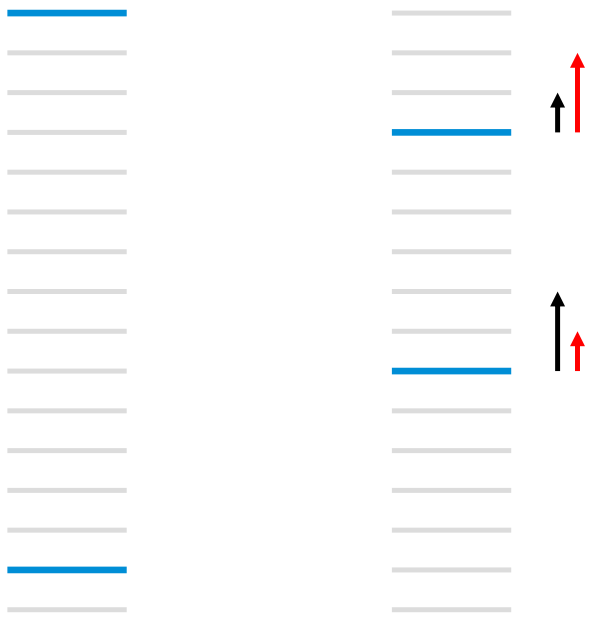

## 信息检索3 排序学习

### 3.1 排序学习方法简介

**排序学习(learning to rank, LTR)**是搜索算法中的重要一环，**RankNet和LambdaRank**算法是两种具有代表性的算法。搜索的本质是自动选取与用户输入的**关键词(query)**最相关的一组**文档(docs, 或URLs)**的过程。目前主要通过如下两个步骤实现：

(1) **query-doc匹配**：寻找与当前输入的query相关度高的docs；

(2) **高相关度docs精确排序**：对(1)中返回的docs，选取更多特征并按照用户点击该doc的可能性大小精确排序。有时我们还会选择不同的特征，召回多组(1)并将它们通过排序算法融合为一组。

**LTR就是一类目前最常用的，通过机器学习实现步骤(2)的算法**。它主要包含单文档方法(pointwise)、文档对方法(pairwise)和文档列表(listwise)三种类型。**pointwise单文档方法**顾名思义：对于某一个query，它将每个doc分别判断与这个query的相关程度，由此**将docs排序问题转化为了分类(比如相关、不相关)或回归问题(相关程度越大，回归函数的值越大)**。但是pointwise方法只将query与单个doc建模，建模时**未将其他docs作为特征进行学习，也就无法考虑到不同docs之间的顺序关系**。而排序学习的目的主要是对搜索结果中的docs根据用户点击的可能性概率大小进行排序，所以pointwise势必存在一些缺陷。

针对pointwise存在的问题，**pairwise文档对方法**并不关心某一个doc与query相关程度的具体数值，而是将排序问题转化为**任意两个不同docs** $d_i$和$d_j$**谁与当前query更相关的相对顺序的排序问题**，一般分为$d_i$比$d_j$**更相关、更不相关和相关程度相等三个类别**，记为$\{+1,-1,0\}$，由此便又转化为了**分类问题**。**RankNet和LambdaRank算法同属于pairwise方法，是很多排序算法的雏形**。

而**listwise文档列表方法**则是将一个query对应的所有相关文档看作一个整体，作为单个训练样本。

RankNet、LambdaRank和LambdaMART同属于**pairwise方法**。对于某一个query，pairwise方法并不关心某个doc与这个query的相关程度的具体数值，而是将对所有docs的排序问题转化为**求解任意两个docs的先后问题**，即：根据docs与query的相关程度，比较任意两个不同文档$doc_i$和$doc_j$相对位置关系，并将query更相关的doc排在前面。一般使用$doc_i$比$doc_j$**更相关、更不相关和相关程度相等**三个类别，并分别使用$\{+1,-1,0\}$作为对应的类别标签，然后使用**文档对**$\langle doc_i,doc_j \rangle$作为**样本的输入特征**，由此将排序问题转化为了分类问题。这样做的另一个好处是，**无需对每个doc与query的相关性进行精确标注(实际大规模数据应用场景下很难获得)，只需获得docs之间的相对相关性，相对容易获得，可通过搜索日志、点击率数据等方式获得**。

### 3.2 检索排序评价指标

### 3.3 RankNet

RankNet是一种pairwise方法，其与具体的模型无关，**只需要模型中的参数是可学习的(可导的)**。通常可以使用神经网络模型实现RankNet，但还可以使用GBDT等模型。其工作原理如下：对于一个给定的查询，选取标签不一样的文档(URLs)$U_i$和$U_j$，该标签通常是上文提到的$S_{ij} \in \{+1,-1,0\}$。将两个文档提取为特征向量$x_i$和$x_j$后，通过**自己设计的模型**对两个文档分别进行打分，得到$s_i=f(x_i)$以及$s_j=f(x_j)$。设$U_i \triangleright U_j$表示文档$U_i$比$U_j$**应当排名更高**(例如在数据集中$U_i$被点击过而$U_j$未被点击过，或$U_i$**点击率**比$U_j$更高；且对于不同查询，相同的URL的标签也会不同)，模型的两个输出用于学习一个概率，即文档$U_i$应当排名比$U_j$更靠前的概率，该概率通过sigmoid函数来学习，即：
$$
P_{i j} \equiv P(U_{i} \triangleright U_{j}) \equiv \frac{1}{1+e^{-\sigma(s_{i}-s_{j})}}
$$
其中参数$\sigma$决定了sigmoid函数的形状。使用交叉熵函数进行学习：
$$
C=-\bar{P}_{i j} \log P_{i j}-(1-\bar{P}_{i j}) \log (1-P_{i j})
$$
其中，$\bar P_{ij}$是$U_i$排名高于$U_j$的已知概率，其与标签的换算关系为$\bar{P}_{i j}=\frac{1}{2}(1+S_{i j})$，即将标签$S_{ij} \in \{+1,-1,0\}$映射到$\{1,0,0.5\}$内。联立以上公式可以得到交叉熵损失函数$C$的具体表达式：
$$
C=\frac{1}{2}(1-S_{i j}) \sigma(s_{i}-s_{j})+\log (1+e^{-\sigma(s_{i}-s_{j})})
$$
注意，当$s_i=s_j$时，损失函数的值为$\log 2$，因此**对于不同标签的文档，当模型为它们打了相同的分数时，其仍然会在学习过程中远离彼此**。

损失函数$C$对$s_i$和$s_j$分别求导，有：
$$
\frac{\partial C}{\partial s_{i}}=\sigma\left(\frac{1}{2}(1-S_{i j})-\frac{1}{1+e^{\sigma(s_{i}-s_{j})}}\right)=-\frac{\partial C}{\partial s_{j}}
$$
有了梯度以后，便可以使用梯度下降算法反向传播误差，来更新参数$w_k$：
$$
w_{k} \rightarrow w_{k}-\eta \frac{\partial C}{\partial w_{k}}=w_{k}-\eta\left(\frac{\partial C}{\partial s_{i}} \frac{\partial s_{i}}{\partial w_{k}}+\frac{\partial C}{\partial s_{j}} \frac{\partial s_{j}}{\partial w_{k}}\right)
$$

### 3.4 Factoring RankNet: 加速RankNet的训练

在RankNet中，对于给定的一个文档对$U_i$和$U_j$，有：
$$
\begin{aligned}\frac{\partial C}{\partial w_{k}} &=\frac{\partial C}{\partial s_{i}} \frac{\partial s_{i}}{\partial w_{k}}+\frac{\partial C}{\partial s_{j}} \frac{\partial s_{j}}{\partial w_{k}}\\&=\sigma\left(\frac{1}{2}(1-S_{i j})-\frac{1}{1+e^{\sigma(s_{i}-s_{j})}}\right)\left(\frac{\partial s_{i}}{\partial w_{k}}-\frac{\partial s_{j}}{\partial w_{k}}\right) \\&=\lambda_{i j}\left(\frac{\partial s_{i}}{\partial w_{k}}-\frac{\partial s_{j}}{\partial w_{k}}\right)\end{aligned}
$$
其中，
$$
\lambda_{i j} \equiv \frac{\partial C(s_{i}-s_{j})}{\partial s_{i}}=\sigma\left(\frac{1}{2}(1-S_{ij})-\frac{1}{1+e^{\sigma(s_{i}-s_{j})}}\right)
$$

设$I$为在给定查询下返回的文档集中**下标不相同的全部文档对**$\{i,j\}$的集合(若返回$n$个文档，则$I$的大小为$C^2_n$)。$I$中必须包含每对文档仅一次，并且通常设定对于每个文档对，$U_i \triangleright U_j$，因此$S_{ij}=1$总是成立的，这样**可以对上式进行化简**。

集合$I$对一个参数$w_k$进行的总共的更新如下：
$$
\delta w_{k}=-\eta \sum_{\{i, j\} \in I}\left(\lambda_{i j} \frac{\partial s_{i}}{\partial w_{k}}-\lambda_{i j} \frac{\partial s_{j}}{\partial w_{k}}\right) \equiv-\eta \sum_{i} \lambda_{i} \frac{\partial s_{i}}{\partial w_{k}}
$$
其中，
$$
\lambda_{i}=\sum_{j:\{i, j\} \in I} \lambda_{i j}-\sum_{j:\{j, i\} \in I} \lambda_{i j}
$$
原始RankNet中，我们使用**随机梯度下降**，即每对文档进行一次参数更新。但是若将每个文档对积累起来，可以进行一次总的更新。这便相当于**小批量梯度下降(mini-batch gradient descent)**，但这个方式是由排序学习本身的性质得到的，并非小批量梯度下降的直接应用。该方式可以明显提升RankNet算法的训练速度，因为由于反向传播算法中单个参数的更新是需要极大开销的，而这样累计的方式很明显对训练起到了加速的作用。

### 3.5 LambdaRank

RankNet的实质是**减小pairwise的误差**，但其并不适合某些评价指标。下图中，蓝色为搜索引擎返回的相关文档，而灰色为不相关文档。在左图中，返回结果的**误差为13**；在右图中，经过一次参数学习，**误差被降为11**，有了明显的减小。然而，对于**NDCG和ERR等评价指标**，其**仅关注top k个返回结果的顺序**，因此右图中的评价结果可能**并不提高，反而变差**。左边的黑色箭头表示RankNet梯度(随着成对错误的数量而增加，因此靠下的相关文档上升更快)，而我们真正想要的是右边的红色箭头。

LambdaRank是一个经验算法，它不是通过显示定义损失函数再求梯度的方式对排序问题进行求解，而是分析排序问题需要的梯度的物理意义，直接定义梯度，即Lambda梯度。假设使用NDCG进行评价，LambdaRank算法在RankNet算法的加速形式：
$$
\lambda_{i j} \equiv \frac{\partial C(s_{i}-s_{j})}{\partial s_{i}}=\sigma\left(\frac{1}{2}(1-S_{i j})-\frac{1}{1+e^{\sigma(s_{i}-s_{j})}}\right),S_{ij}
$$
的基础上加入一个引子$|\Delta NDCG|$，即交换两个文档$U_i$和$U_j$的**位置**(而其他文档位置不变)引起的**评分的变化**：
$$
\lambda_{i j}=\frac{\partial C(s_{i}-s_{j})}{\partial s_{i}}=\frac{-\sigma}{1+e^{\sigma(s_{i}-s_{j})}}|\Delta_{N D C G}|
$$
**损失函数的梯度代表了文档下一次迭代优化的方向和强度**，由于引入了IR评价指标NDCG，**Lambda梯度更关注位置靠前的优质文档的排序位置的提升**。有效的避免了下调位置靠前优质文档的位置的发生。LambdaRank算法相比RankNet算法的优势在于**分解因式后训练速度变快**，同时**考虑了评价指标**，直接对问题求解，效果更明显。

### 3.6 LambdaMART

### 参考资料

[1] Burges C J C , Shaked T , Renshaw E , et al. Learning to rank using gradient descent. Machine Learning, Proceedings of the Twenty-Second International Conference (ICML 2005), Bonn, Germany, August 7-11, 2005.

[2] Burges C J C. From ranknet to lambdarank to lambdamart: An overview. Learning, 2010, 11(23-581): 81.