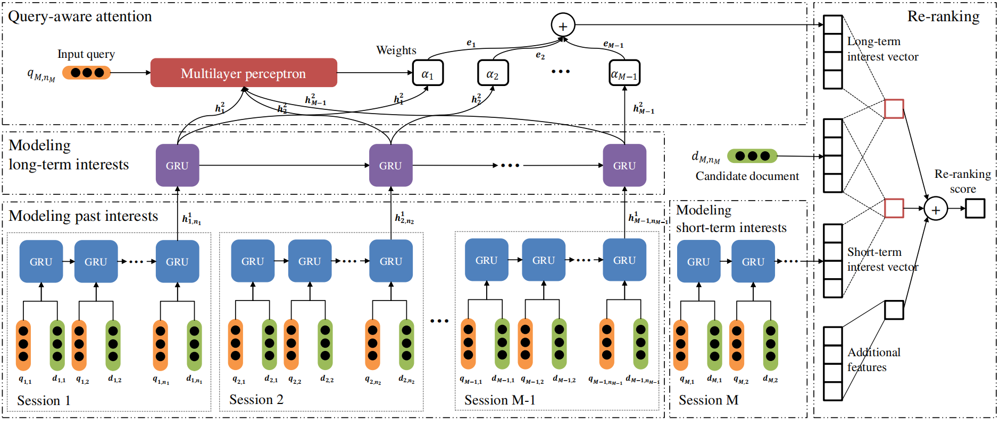
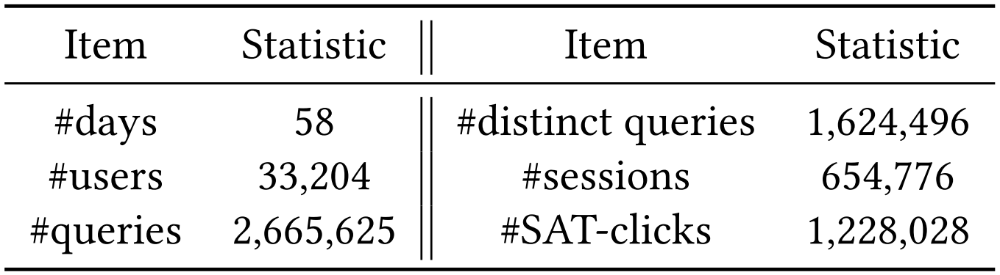
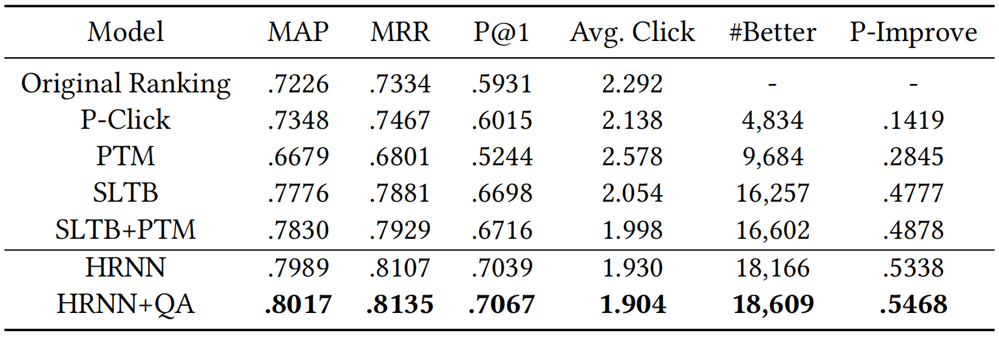
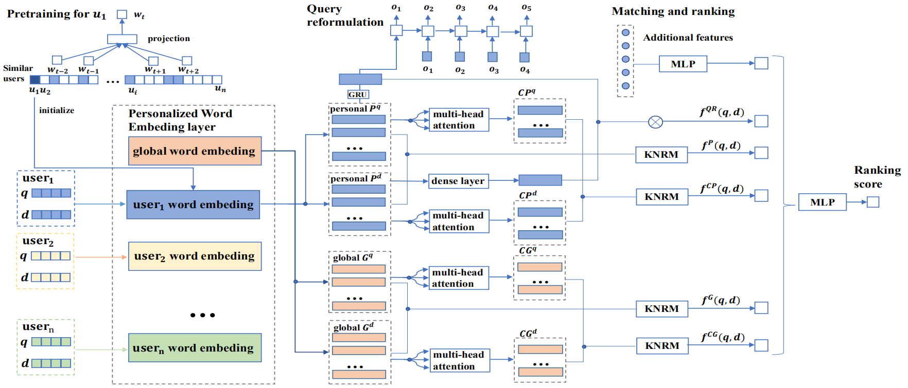
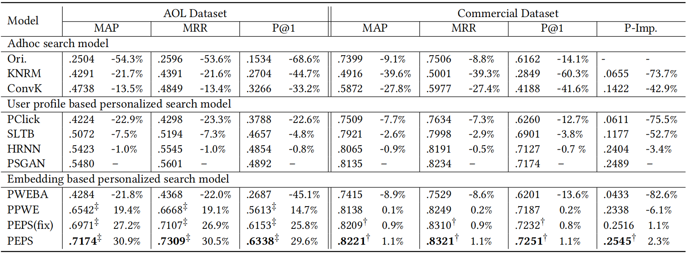
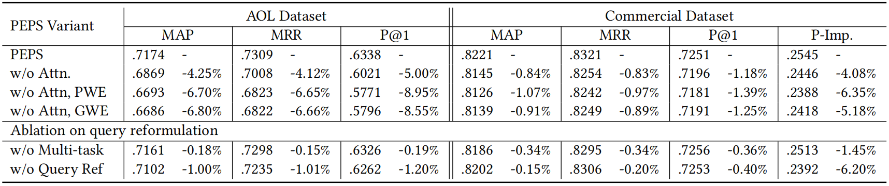
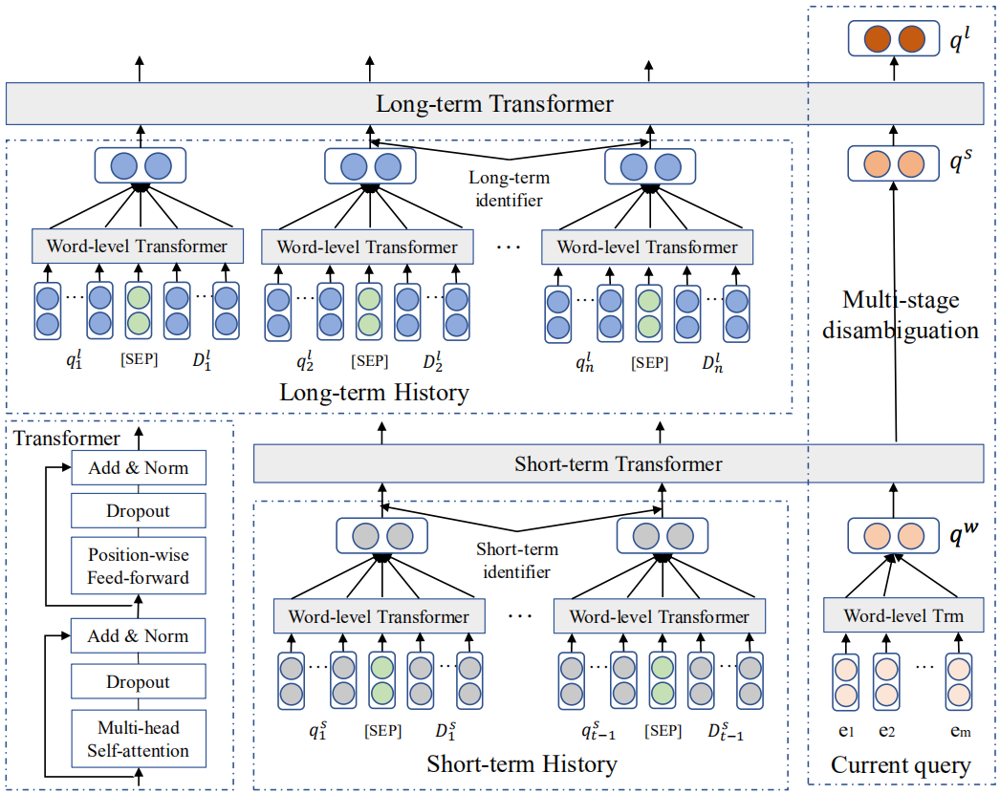
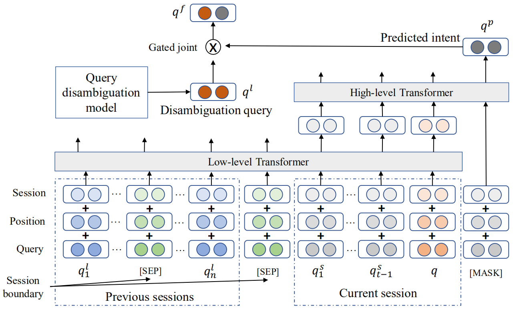
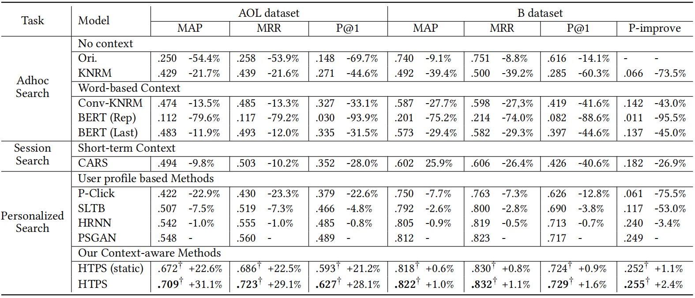

## 信息检索4 个性化检索

### 4.1 个性化信息检索简介

非个性化搜索引擎存在的一个问题是，当用户发出查询时，每个用户所获取的结果是相同的[1]。而事实上，绝大多数用户输入的查询都是**短的并且模糊的(short and ambiguous)**，并且**不同用户在相同的查询下往往有着不同的信息需求**。例如，生物学家查找“mouse”是为了查询老鼠相关的信息，而程序员查找“mouse”是为了查询鼠标相关的信息。当这样的包含歧义的查询被输入到搜索引擎中，用户需要花费一定的时间来寻找他们所需要的信息。另外，当用户搜索“free mp3 download”时，他们都是想下载免费的mp3音乐，但是mp3下载网站有多个，而每个用户偏好访问的网站也存在着很大的不同。

**个性化检索(personalized retrieval)**，即根据用户的**画像(profile)**或**检索日志(query log)**来为特定用户返回特定的信息，被认为是一种很好的解决方案。目前已有多种个性化检索的策略以及系统，但仍有很大的优化空间。

当前个性化搜索的一个问题是**大多数提出的方法被统一地应用于所有用户和查询**。 实际上，我们认为**不应以相同的方式处理不同的查询**，原因有如下几点：

(1) **个性化对于某些查询起不到很大作用，而且也没有必要将这些查询个性化**。像上文中“mouse”这样的查询，确实可以获得相关性更好的结果；但是**对于“Google”这样的搜索，绝大多数用户的信息需求都是想要访问Google搜索的首页**，因此对于这种查询，没有个性化的必要。

(2) **不同的策略可能会对不同的查询产生不同的影响**。对于查询“mouse”，使用典型的基于用户兴趣画像的个性化方法可以获得更好的结果，但对于“free mp3 download”这样的查询，可能会获得较差的结果。因为，“free mp3 download”的**查询结果大多数被分类为一个主题类别**，基于用户画像的个性化过于粗糙，无法过滤出所需的结果。在这种情况下，**只需利用此用户过去访问过的页面**可能会取得更好的效果。

此外，单纯地将个性化不假思索地应用到一些查询时，反而会对查询结果产生负面影响。例如，当一个运动迷查询“office”，他的信息需求可能并不和体育相关，而是查找office软件。在这种情况下，**基于兴趣的个性化反而会返回一些无关的结果在前面**，使得用户感到困惑。

(3) **基于不同的搜索历史并在不同的上下文中，个性化检索的有效性也存在差异**。例如，对于几乎没有搜索历史的用户是很难进行个性化的；此外，用户的检索通产都是满足其**短期信息需求**，这与用户的普遍兴趣存在一定的不一致性。在这种情况下，**长期的用户画像文件可能没有用，而短期查询上下文可能更有用**。

### 4.2 用于个性化检索的Hierarchical RNN

论文[2]提出，搜索结果个性化是提升搜索引擎质量的有效手段。先前的研究从**用户的点击记录、用户的主题兴趣以及点击熵**等方面提取信息，来改变搜索结果的排序。然而，很少有研究考虑**queries和sessions的序列信息**。直觉上，查询的顺序对于推断用户的兴趣是很重要的，并且距离近的sessions提供的个性化信息比距离远的sessions提供的个性化信息更加可靠。该论文提出一种**层次化的循环神经网络**来提取序列信息，并**根据历史数据自动生成用户的画像**。此外，该论文还提出一种**query-aware attention模型**来根据用户的输入查询动态地生成用户画像。**该attention模型能够关注先前用户的queries和sessions对于当前用户的query来说的重要部分**。

用户的偏好是随时间变化的，许多研究尝试将其分为**短期(short-term)和长期(long-term)偏好**。短期偏好指一个session内的查询，其对于预测当前查询任务接下来的查询意图十分有用；长期偏好用于描述多个sessions内的查询，其对于捕获用户更加长远的、稳定的特征有重要作用。两种偏好可以分别用low-level RNN和high-level RNN进行建模。**文章采用LambdaRank算法进行排序学习**。

问题定义如下：假定对于**用户**$u$，其**查询日志**为$\mathcal L_u$，其中包含**过去的sessions**：$\mathcal L_u=\{\mathcal S_1,\cdots,S_{M-2},S_{M-1}\}$以及**当前的session**：$\mathcal S_M$，其中$M$是当前session的索引。每个session被定义为一个查询序列以及一个对每个查询返回的文档的列表，记为$\mathcal S_m=\{\{\boldsymbol q_{m,1},\boldsymbol d_{m,1,1},\cdots\},\cdots\{\boldsymbol q_{m,n_m},\boldsymbol d_{m,n_m,1},\cdots\}\}$，其中$n_m$代表session$\mathcal S_m$中查询的个数。在当前查询$\mathcal S_M$中，用户输入查询$\boldsymbol q_{M,n_M}$，搜索引擎返回一个文档排序列表$\mathcal D=\{\boldsymbol d_1,\boldsymbol d_2,\cdots\}$，其中$\boldsymbol d_i$简记为$\boldsymbol d_{M,n_M,i}$。对于每个文档，我们想要基于当前查询$\boldsymbol q_{M,n_M}$、过去的session$\mathcal L_u$以及$\mathcal S_M$计算一个相关性分数：
$$
\begin{aligned}
\operatorname{score}\left(\boldsymbol{d}_{i}\right) &=\operatorname{score}\left(\boldsymbol{d}_{i} | \boldsymbol{q}_{M, n_{M}}, \mathcal{S}_{M}, \mathcal{S}_{M-1}, \ldots, \mathcal{S}_{1}\right) \\
&=\operatorname{score}\left(\boldsymbol{d}_{i} | \boldsymbol{q}_{M, n_{M}}\right)+\operatorname{score}\left(\boldsymbol{d}_{i} | \mathcal{L}_{u}\right)+\operatorname{score}\left(\boldsymbol{d}_{i} | \mathcal{S}_{M}\right)
\end{aligned}
$$
最后，我们根据每个文档的分数，对文档列表$\mathcal D$进行**重排(re-rank)**。本文的网络结构如下所示：

该网络的设计主要有三个模块：

(1) **exploiting sequence-enhanced user interests**：使用GRU来对短期用户兴趣和长期用户兴趣进行建模。对于短期用户兴趣session $\mathcal S_m$，RNN的输入为$\mathcal{S}_{m}^{\prime}=\left\{\left\{\boldsymbol{q}_{m, 1}, \mathcal{D}_{m, 1}\right\}, \cdots,\left\{\boldsymbol{q}_{m, n_{m}}, \mathcal{D}_{m, n_{m}}\right\}\right\}$，其中$\mathcal D_{m,i}$为在输入的查询$\boldsymbol q_{m,i}$下被点击的文档的集合。我们使用$\boldsymbol q_{m,i}$和$\boldsymbol d_{m,i}$的**拼接(concatenation)**作为RNN第$i$步的输入，其中$\boldsymbol d_{m,i}$是文档集合$\mathcal D_{m,i}$中**所有文档向量的平均向量**。如果用户对于查询$\boldsymbol q_{m,i}$没有满足的文档，则$\boldsymbol d_{m,i}$被设置为零向量。对于每个**查询**$\boldsymbol{q} \in \mathbb{R}^{d_{e}}$以及**文档**$\boldsymbol{d} \in \mathbb{R}^{d_{e}}$，**其表示通过所包含的单词的词向量进行带权(TF-IDF)平均而得到**，而词向量通过**查找表**的方式从词嵌入矩阵$W \in \mathbb R^{|V| \times d_e}$中得到。最终，按照GRU的运算过程，**每个session输出GRU最后一个时间步的隐含层向量**$\boldsymbol h^1_{m,n}$。

对于用户的长期兴趣，设计high-level RNN，将low-level RNN在每一个session的输出作为其输入，每一个时间步进行一次输出(按时间采样)，产生$M-1$个输出向量$\{\boldsymbol h^2_1,\cdots,\boldsymbol h^2_{M-1}\}$。

(2) **modeling dynamic user profiles**：在不同的搜索环境下，相同的过去互动可能会对个性化排名产生不同的影响。基于此，**使用注意力机制，基于当前的查询，对每个之前的session应用不同的权重**。公式如下：
$$
\begin{aligned}
e_{i} &=\phi(\boldsymbol{q}_{M, n_{M}}, \boldsymbol{h}_{i}^{2}) \\
\alpha_{i} &=\frac{\exp (e_{i})}{\sum_{j=1}^{M-1} \exp (e_{j})} \\
\boldsymbol{h}_{M-1}^{2, q}&=\sum_{i=1}^{M-1} \alpha_{i} \boldsymbol{h}_{i}^{2}
\end{aligned}
$$
其中，$\phi$是激活函数为tanh的**全连接神经网络**，这是注意力机制的一种形式，也可以用其他形式进行替换。总的来说，**最终的短期和长期兴趣向量(short- and long-term interest vectors)**被分别表示为$\boldsymbol h^1_{M,n_m}$和$\boldsymbol{h}_{M-1}^{2, q}$，二者接下来被用于将搜索结果重新排序。

(3) **re-ranking**：给定短期和长期兴趣向量$\boldsymbol h^1_{M,n_m}$和$\boldsymbol{h}_{M-1}^{2, q}$，我们可以计算**文档的个性化的排名分数**：
$$
\begin{aligned}
\operatorname{score}(\boldsymbol{d}_{i} | \mathcal{L}_{u})&=\operatorname{sim}((\boldsymbol{h}_{M-1}^{2, q})^{T} \boldsymbol{W}_{L}, \boldsymbol{d}_{i}) \\
\operatorname{score}(\boldsymbol{d}_{i} | \boldsymbol{S}_{M})&=\operatorname{sim}((\boldsymbol{h}_{M, n_{m}}^{1})^{T} \boldsymbol{W}_{S}, \boldsymbol{d}_{i})
\end{aligned}
$$
其中，$\boldsymbol W_{S} \in \mathbb{R}^{d_{h^1} \times d_{e}}, \boldsymbol W_{L} \in \mathbb{R}^{d_{h^2} \times d_{e}}$是两个相似度矩阵，其功能是将短期和长期的向量**映射到和文档向量相同大小的空间**，其在训练过程中逐渐被优化。相似度计算函数被定义为：
$$
\operatorname{sim}(X, Y)=\frac{X^{\text T} Y}{\|X\| \cdot\|Y\|}
$$
此外，还需要将查询-文档相关特征以及基于点击率的特征加入模型作为额外的特征。在该论文中，作者使用原始文档顺序作为一个特征，还使用基于点击率的特征，包括候选文档的历史点击数、在输入查询下的候选文档点击数以及输入查询的**点击熵(click entropy)**。加入点击熵作为特征的原因是，**根据不同的输入，需要个性化的程度也不同，无差别地个性化所有查询有时会对查询结果产生负面影响**。

本文选用一个基础的排序算法**LambdaRank**来训练整个框架。首先生成训练对，将**SAT-clicked文档**视为**相关样本**，并将**其他文档**视为**不相关样本**。对于一对相关文档和不相关文档$\boldsymbol d_i$和$\boldsymbol d_j$，其损失函数为：
$$
\text{loss}=(\bar{p}_{ij}\log(p_{ij})-\bar{p}_{ji}\log(p_{ji}))|\Delta|
$$
其中，$p_{ij}$是所**预测的**$\boldsymbol d_i$比$\boldsymbol d_j$更相关的概率，$\bar p_{ij}$是**真实的**概率。预测概率$p_{ij}$可以由下式计算：
$$
p_{ij}=\frac{1}{1+\exp(-(\text{score}(\boldsymbol d_i)-\text{score}(\boldsymbol d_j)))}
$$
实验所使用的数据集从一个商业搜索引擎中进行随机采样。数据的log中包含多个piece，每个piece中包含如下内容：(1) an anonymous user id；(2) **a query**；(3) a session id；(4) query issued time；(4) **the top 20 URLs retrieved by the search engine**；(5) **clicks**；(6) dwelling time。数据集的基本统计信息如下：

SAT-clicks的选取规则为：将**停留时间(dwelling time)超过30秒**或者是**最后一次访问**的页面作为SAT-clicks。实验使用**前六周的数据**来生成**基本用户画像**，并使用剩余的两周数据进行模型的训练和预测。对于每个用户，我们将其sessions按照五比一的比例(按照时间线)划分为训练集和测试集，并将训练集中最后五分之一的sessions划分为验证集。对于查询日志中的每个URL，提取其信息，去掉无效URL，并进行停用词去除、标点去除等预处理。

HRNN与其他模型在不同评价准则上的对比如下(QA指query-aware attention)：

### 4.3 个性化词嵌入

文章[3]提出**个性化词向量(personnel word embedding)**。其主要思想是，**对于不同的用户，每个单词应该具有不同的语义表示(嵌入)**。其步骤如下：首先，为每个用户训练**个性化词嵌入**，其中每个词的表示方式主要**取决于用户的个人数据**。然后，配合注意力机制获得**查询和文档的个性化单词和上下文表示**。 最后，使用匹配模型来计算**个性化查询和文档表示之间的匹配分数**。

不同的用户对相同的词汇存在不同的理解，因此查询意图也不同。为了使得这种个性化的含义更加清晰，我们认为**相同的单词对于不同的用户应该被认为是不同的单词**，具有不同的语义表示。因此，我们提出了一种个性化模型，该模型**针对每个用户使用自己的搜索历史作为训练数据，来从全局词嵌入进一步训练个人词嵌入**。

整个网络结构如下图所示：

每个用户$u_i$拥有一个自己的词嵌入矩阵，该矩阵从与$u_i$相似的用户的查询日志中预训练得到。给定用户$u_i$的查询$q$以及一个文档$d$(如上图所示)，嵌入层将查询和文档中所有单词映射为全局词向量$G^q,G^d$和个性化词向量$P^q,P^d$，再将四个词向量列表分别使用**多头注意力(multi-head attention)机制**，来获得其分别的**上下文相关的表示**。个性化查询词向量列表$P^q$输入一个GRU中，得到**查询意图向量(query intent vectors)**，用于**查询重构(query reformulation)**，该过程基于seq2seq架构(图中间部分最上方)。最后，我们使用**神经匹配组件KNRM计**算文档相关性得分，并通过联合学习训练模型。

问题的形式化定义如下：假定系统中的用户为$u_1,u_2,\cdots$，每个用户$u_i$在截至时间$T$有其自己的搜索历史$H_i^T$。该搜索历史包含一系列查询$\{q_{i,1},q_{i,2},\cdots,q_{i,N_i^T}\}$(均为用户$u_i$提交)、在每个查询$q_{i,j}$下被点击的文档集合$D^+_{i,j}$以及没有被点击的集合$D^-_{i,j}$。$N_i^T$是搜索历史$H_i^T$中的总查询数目。当前，用户$u_i$输入查询$q$，非个性化的搜索引擎返回一个文档列表$D=\{d_1,d_2,\cdots\}$，个性化搜索模型根据用户查询信息对用户兴趣建模，并对文档列表$D$进行重排。

该论文的个性化搜索模型(简称PEPS)主要包含三个阶段：**(1) 个性化词向量的预训练阶段；(2) 网络模型的监督训练阶段；(3) 在线更新阶段**。

#### 4.3.1 个性化词向量的预训练

个性化词向量训练的最初想法是，用户$u_i$的个性化词向量可以直接使用用户$u_i$的查询历史和点击文档历史进行训练。然而，通常来说单个用户的查询记录是不够的。本论文使用两种方法进行优化：

(1) 在整个查询日志上训练一个**全局的word2vec模型**，作为每个用户个性化词向量模型的**初始值**；

(2) 对每个用户，选取**其top k个兴趣相似的用户**，然后每个人的个性化词向量由这些用户的语料进行训练。文章采用**基于用户的协同过滤算法(user-based collaborative filtering algorithm)**来寻找兴趣最相近的用户。具体来说，设用户相似度矩阵为$W$，用户$u_i$和$u_j$的兴趣相似度$W_{ij}$的计算公式如下：
$$
W_{i j}=\frac{\sum_{d \in N(u_{i}) \cap N(u_{j})} \frac{1}{\log (1+|N(d)|)}}{\sqrt{|N(u_{i})||N(u_{j})|}}
$$
其中，$N(u_i)$和$N(u_j)$分别代表用户$u_i$和$u_j$的点击文档集，$N(d)$是点击过文档$d$的所有用户端的集合。

#### 4.3.2 个性化模型

使用word2vec预训练的词向量能够捕获单词之间的共现数据以及语法关系，但仍未利用用户的兴趣信息。本文使用上文中的网络结构图，利用监督学习的方式，对预训练的词向量进行微调。网络结构主要分为以下四个部分：

##### 4.3.2.1 Personalized Word Embedding Layer

在该部分中，每个用户都拥有一个独一无二的词嵌入矩阵，不同用户的相同单词被视为不同单词，**使用“单词+用户标识符”的方式进行区分**。此外，还保存一个全局的词向量矩阵(通过word2vec预训练得到)。在使用每个用户的数据进行网络的训练时，仅改变当前用户的词嵌入矩阵。

此外，由于全局的词表太大，每个用户保存一个独一无二的**词典(vocabulary)**，其中仅包含**非停用词**、在该用户查询日志中**出现频率**大于$c$的词以及**熵**不小于阈值$ent$的词。在该论文中，**词的熵被定义为包含该词的查询的平均点击熵**，其计算公式如下：
$$
\begin{aligned}
\text{WordEntropy}(w) &=\frac{\sum_{q \in Q(w)} \text {ClickEntropy}(q)}{|Q(w)|} \\
\text{ClickEntropy}(q) &=\sum_{d \in D(q)}-P(d | q) \log _{2}P(d|q)
\end{aligned}
$$
其中，$Q(w)$指包含单词$w$的所有查询的集合，$D(q)$指在查询$q$下被点击的文档的集合，$P(d|q)$指的是在查询$q$下，文档$d$被点击的概率，计算公式为：
$$
P(d|q)=\frac{| \text {Clicks}(q, d) |}{|\text {Clicks}(q, \cdot)|}
$$

##### 4.3.2.2 Query and Document Representation

通过嵌入层，我们能够将查询$q=\{w_{1}^{q},w_{2}^{q},\cdots\}$以及文档$d=\{w_{1}^{d},w_{2}^{d},\cdots\}$映射为高维向量空间的表示。在本文提出的模型中，有四种文本表示：

(1) **个性化单词表示(personalized word representation)**

将**训练集中用户输入的查询以及对应的相关文档**输入个性化嵌入层，得到$P^{q} \in R^{dim \times|q|}$以及$P^{d} \in R^{dim \times|d|}$。这个过程实现了**单词级别的个性化**。

(2) **个性化上下文表示(personalized contextual representation)**

本文使用**多头自注意力机制**来捕获(1)的输出的**上下文相关特征**，产生$CP^{q} \in R^{dim \times|q|}$以及$CP^{d} \in R^{dim \times|d|}$。具体计算方式与Transformer类似：
$$
\begin{aligned}
C P^{q} &=\text{Concat(head}_{1},\text {head}_{2},\cdots,\text{head}_{h})W^{A} \\
\text{head}_{i} &=\operatorname{softmax}\left(\frac{P^{q} W_{i}^{Q}(P^{q} W_{i}^{K})^{T}}{\sqrt{d_{k}}}\right)(P^{q} W_{i}^{V})
\end{aligned}
$$
同理，可以得到文档$d$的个性化上下文表示$CP^d$。$CP^q$和$CP^d$利用了一个查询或一个文档内的上下文特征，**使得多义词的含义变得明确**。

(3) **全局单词表示(global word representation)**

有时候，一个用户对于同一个单词也有不同的信息需求。因此，保留一个全局的词嵌入矩阵是必要的。将训练集中用户输入的查询以及对应的相关文档通过全局词嵌入矩阵进行映射，得到$G^{q} \in R^{dim \times|q|}$以及$G^{d} \in R^{dim \times|d|}$。

(4) **全局上下文表示(global contextual representation)**

与个性化上下文表示相似，通过多头自注意力机制，可以得到$GP^q$以及$GP^d$。

##### 4.3.2.3 Query-Document Matching and Ranking

在本文中，作者通过**神经匹配模型KNRM**来对文档集进行评分，并对返回结果进行重新排序。对于个性化单词表示，首先建立一个相似度矩阵$S^P$，其元素$S^P_{ij}$为查询种单词$w^q_i$和文档中的单词$w^d_j$的**余弦相似度**。然后，许多RBF核被用于相似度矩阵$S^P$来在查询和文档中提取multi-level soft-match特征$\phi(S^P)$：
$$
\begin{aligned}
\phi(S^{P}) &=\sum_{i=1}^{|q|} \log (\vec{K}(S_{i}^{P})) \\
\vec{K}(S_{i}^{P}) &=\{K_{1}(S_{i}^{P}), \ldots, K_{K}(S_{i}^{P})\} \\
K_{k}(S_{i}^{P}) &=\sum_{j} \exp (-\frac{(S_{i j}^{P}-\mu_{k})^{2}}{2 \sigma_{k}^{2}})
\end{aligned}
$$
得到相似度特征$\phi(S^P)$后，使用多层全连接神经网络来结合这些特征，并计算查询和文档的个性化单词表示的匹配分数$f^P(d,q)$：
$$
f^{P}(q, d)=\tanh (W_{P}^{T} \phi(S^{P})+b^{P})
$$
与$f^P(d,q)$相似，可以计算出其他三种匹配分数$f^{CP}(d,q)$、$f^G(d,q)$和$f^{GP}(d,q)$。

除了以上四种query和document之间的相似度分数，再增加一个$f^{QR}(d,q)$，即**重构后的查询与文档之间的匹配分数**。此外，还加入了一些其他特征。将这些特征全部通过一个全连接神经网络，输出一个相关性分数。

使用LambdaRank算法进行模型训练。首先根据查询日志创建文档对，其中被点击的文档作为正样本，未被点击的文档作为负样本。要学习的损失函数为：
$$
\operatorname{loss}=(-\hat{p}_{(i>j)} \log (p_{(i>j)})-\hat{p}_{(i<j)} \log (p_{(i<j)}))|\lambda_{i j}|
$$

##### 4.3.2.4 Query Reformulation

在大多数情况下，**用户使用查询来精确地表示其信息需求是很困难的**。因此，使用seq2seq结构来将用户的查询进行重构，以更好地表达用户的需求。**编码器**的输入为查询的个性化单词表示$q^P$，使用GRU将其进行编码，即：
$$
h_{t}=GRU(P_{t}^{q}, h_{t-1})
$$
最后一个时间步的输出$h_{|q|}$即被作为用户实际的查询意图，并用于计算得分$f^{QR}(d,q)$。该过程即通过一个GRU编码器对用户输入的查询进行了一个变换，并且该变换可以通过网络结构的训练自动生成。**解码器**是GRU与注意力机制的组合，用于**预测用户当前session内的之后的查询**。

我们通过最小化目标序列的负对数似然来训练查询重构模块。 并且通过最小化负对数似然率和pairwise损失的总和来**优化整个多任务框架**。

#### 4.3.3 在线更新

在现实中，用户总是不断输入新的查询，因此在线进行模型参数的更新是必要的。按照更新粒度大小，可以**设置一个定长的stage进行更新，或按照session更新，或按照query进行更新**。

#### 4.3.4 实验结果与分析

实验使用AOL数据集以及另一个商业搜索引擎的数据集，使用**MAP、MRR和P@1**三种评价指标，并使用多种其他检索模型进行对比。实验结果如下：

### 4.4 个性化检索中的上下文相关表示学习

个性化检索的关键是根据用户的查询历史来明确当前用户查询的含义。论文[4]之前的工作大多是根据用户的搜索历史建立用户画像，并对检索结果进行重排。然而该论文认为，基于用户画像的方法仍会使得许多单词存在歧义，其仅仅是将历史行为进行综合。使用**上下文相关的表示学习**，能够更好地获取用户查询的意图。

先前的研究表明，用户所输入的查询大多数都是**短的**且**模糊的**。本文**抛弃了用户画像的使用**，将用户历史的搜索数据看做**上下文信息**，为未来输入的查询提供更好的表示。具体地，本文设计了两个基于层次化的Transformer的模型，即**查询消歧模型(query disambiguation model)**和**个性化语言模型(personalized language model)**。前者用于根据词项和历史交互多次消除当前查询的歧义，而后者则试图学习用户的个性化搜索模式以更准确地推断出用户意图。

#### 4.4.1 问题定义

假设对于一个用户，其历史数据$H$包含短期历史$H^s$和长期历史$H^l$，其中短期历史包括当前session内的一系列查询以及候选文档，即$H^{s}=\{\{q_{1}^{s}, D_{1}^{s}\}, \cdots,\{q_{t-1}^{s}, D_{t-1}^{s}\}\}$，其中$t$是**当前的时间戳**；长期历史包括在当前session之前所有session中的查询及候选文档，即$\{\{q_{1}^{l}, D_{1}^{l}\}, \cdots,\{q_{n}^{l}, D_{n}^{l}\}\}$，其中$n$是**所有之前的查询数目**。

给定一个**新的查询**$q$以及**搜索引擎返回的一个候选文档列表**$D=\{d_1,d_2,\cdots\}$，我们的任务是基于当前查询$q$和历史$H$给每个文档一个**评分**$p(d|q,H)$。

之前的普遍方法通常关注从历史数据$H$中提取**个性化的特征**，而本文尝试使用历史数据$H$来增强查询$q$的表示。设改进后的查询表示为$q^H$，则本文采用的评分$p(d|q,H)$的计算方式为：$p(d|q,H)=\phi(p(d,q),p(d,q^H))$。其中，$p(d,q)$是原始查询和文档的ad-hoc相关性，$p(d,q^H)$是由历史数据增强的上下文感知查询表示的**个性化相关性**。函数$\phi()$可以是多层感知机，激活函数为tanh。

#### 4.4.2 多阶段的查询消歧

为了明确用户查询的意图，本文首先建立了一个**多阶段查询消歧模型**。该模型结合了当前查询词项、短期历史和长期历史，并使用层次化的Transformer对其进行编码：

整个结构包含如下三个部分：

(1) **单词级别的消歧(word-level disambiguation)**

对于查询中含义模糊的单词，其上下文往往能够在一定程度上确定其含义。对于当前查询$q$，假设其由$m$个词项组成，即$q=\{e_1,e_2,\cdots,e_m\}$。使用Transformer，可以为每个词项学得上下文相关的表示：
$$
E^{w}=\operatorname{Trm}(q+q_{p})
$$
其中$q \in \mathbb R^{m \times d}$和$q_p \in \mathbb R^{m \times d}$分别为查询$q$中的**原始词嵌入**(可以由word2vec获取)以及**位置嵌入**。Transformer包含multi-head self attention(MS) layer以及position-wise feed-forward(PF) layer，其运算过程如下：
$$
\begin{aligned}
\operatorname{Trm}(q) &=\mathrm{LN}(M_{q}+\mathrm{D}(\mathrm{PF}(M_{q}))) \\
M_{q} &=\mathrm{LN}(q+\mathrm{D}(\mathrm{MS}(q)))
\end{aligned}
$$
其中，$\text{LN}$指layer normalization层，用于使每一层输出的范围变得稳定；$\text{D}$指dropout层，dropout率设为0.1。Transformer中的核心是多头自注意力机制：
$$
\begin{aligned}
\operatorname{MS}(q) &=[\text {head}_{1}, \ldots, \text {head}_{k}] W^{O} \\
\text {head}_{i} &=\operatorname{Att}(q W_{i}^{Q}, q W_{i}^{K}, q W_{i}^{V}) \\
\operatorname{Att}(Q, K, V) &=\operatorname{softmax}\left(\frac{Q K^{T}}{\sqrt{d / h}}\right) V
\end{aligned}
$$
**Transformer层的输出**$E^{w}=\{e_{1}^{w}, e_{2}^{w}, \ldots, e_{m}^{w}\}$可以看做**每个词项的上下文相关表示**。

为了减少下游任务的计算开销，将查询$q$中所有词项的上下文相关表示之和作为整个查询的上下文相关表示：
$$
q^{w}=\sum_{i=1}^{m} e_{i}^{w}
$$
(2) **短期消歧(short-term disambiguation)**

用户输入的查询通常都是非常短的，有时仅有一个单词。在这种情况下，**单词级别的消歧无法满足需要**。通常情况下，**在一个session中，用户只有一个信息需求**。用户在一个session内的查询以及点击的链接为用户信息需求的消歧提供了很大帮助。因此，这种短期的上下文信息可以被用于查询的消歧。

对于短期历史$H^s$内的每个查询，将查询与满足要求的文档结合起来，并用[SEP]符号进行分割。将每个查询对应位置的输出$h_i^{s w}$作为其上下文信息，所有位置的查询对应的输出组成短期嵌入信息$H^{s w}=\{h_{1}^{s w}, \cdots, h_{t-1}^{s} w\}$。此后将$H^{s w}$与$q^w$进行连接，并输入**短期Transformer**中，得到短期嵌入向量$q^s$：
$$
q^{s}=\operatorname{Trm}^{last}([H^{s w}, q^{w}]+[H^{s w}, q^{w}]_{p^{+}})
$$
其中，$\operatorname{Trm}^{last}$指仅取Transformer最后一个位置的输出(对应于$q^w$)。位置编码$p^+$不仅仅考虑一个序列中的相对位置，而且要考虑层次化信息。其基本思想是，**短期历史在绝对位置上更近，应该比长期历史更加受到关注**。

(3) **长期消歧(long-term disambiguation)**

对于一些在session开始阶段的短查询，单词消歧和短期消歧均无法处理。长期历史往往反映用户固定的兴趣，因此，**长期消歧将用户的长期历史进行编码，已达到消歧的目的**。与短期消歧类似，将长期历史$H^l$中每个查询和满足要求的文档经过单词消歧后产生向量$H^{l^{w}}=\{h_{1}^{l^{w}}, \cdots, h_{n}^{l^{w}}\}$，将其与$q^s$连接后送入**长期Transformer**中，得到编码长期上下文信息的查询表示向量$q^l$：
$$
q^{l}=\operatorname{Trm}^{last}([H^{l^{w}}, q^{s}]+[H^{l^{w}}, q^{s}]_{p^{+}})
$$
经过三个消歧阶段后，得到的查询表示向量$q^w,q^s$和$q^l$被用于下一步文档的得分计算。但是，在某些情况下，它们不足以准确表达用户的意图。 这就需要**个性化语言模型(personalized language model)**来解决。

#### 4.4.3 个性化语言模型

消歧模型的前提是，我们假定用户的信息需求隐藏在当前查询中。但是有些情况下，用户输入的查询和真实的信息需求存在一定的偏差。例如，一名用户想要搜索关于**药物aspirin**的信息，但是他忘记了该药物的名字，于是他搜索**a common antiphlogistic medicine(偏差表达)**或者一个类似的名字**asp...(错误拼写)**。这些查询并不包含歧义信息，并且简单的消歧方法很难对其有帮助。因此，建立如下所示的个性化语言模型来预测用户真实需求：

对于整个查询日志，相同模式的查询会出现多次。换句话说，在一个session内一系列不准确的查询也可以反映一个明确的信息需求。当搜索引擎再次遇到这种查询时，有助于了解用户的意图。我们的目标是学习这样的搜索模式，并且基于已有的查询去预测用户的信息需求。该过程分为两步：

(1) **Modeling the current search pattern**：给定当前session内的查询$Q^{s}=\{q_{1}^{s}, \cdots, q_{t-1}^{s}, q\}$，我们想要使用长期历史中相似的模式来提升$Q^s$内查询的表示。将长期历史记作$Q^{l}=\{q_{1}^{l}, \cdots, q_{n}^{l}\}$，每个查询的嵌入表示由其中每个单词的词向量平均得到。为了将查询模式分离，**使用[SEP]符号对长期历史中每个session进行区分**，并且将**session embedding**加入到输入中。最终，使用一个low-level Transformer对先前session和当前session的查询进行编码：
$$
Q^{s l}=\operatorname{Trm}([Q^{l}, Q^{s}]+[Q^{l}, Q^{s}]_{p}+[Q^{l}, Q^{s}]_{s})
$$
(2) **Predicting the real intent**：第一步得到的$Q^{s l}$是当前session内查询$Q^s$的增强。接下来，基于high-level的Transformer，使用$Q^{s l}$来预测用户的真实意图。具体地，在$Q^{s l}$后添加一个[MASK]标记，high-level Transformer的输出$q^p$被认为是预测的用户真实意图：
$$
q^{p}=\operatorname{Trm}^{last}([Q^{s l},[\mathrm{MASK}]]+[Q^{s l},[\mathrm{MASK}]_{p}).
$$
预测意图$q^p$汇总了所有现有查询信息，并推断当前时间最有可能的意图。 为了更好地优化此模型，我们选择**预测一个session内的下一个查询**这种方式对模型进行训练。

#### 4.4.4 两个模型的结合

disambiguated representation $q^l$和estimated user intent $q^p$对于推断用户的信息需求都很重要，并且在不同情况下，其发挥的作用也是不相同的。本文使用门控单元对$q^l$和$q^p$进行综合：
$$
q^{f}=z * q^{l}+(1-z) * q^{p}
$$
其中，$z$由一个带有sigmoid激活函数的全连接层获得：
$$
z=\phi([q, q^{p}, q^{l}])
$$

#### 4.4.5 检索结果的重排

文档评分由上述推导的各个上下文相关向量表示进行计算。对于文档$d$，使用word-level Transformer将其变为上下文相关的文档表示$d^w$，然后计算$p(d,q^H)$：
$$
p(d, q^{H})=\phi(s^{R}(q^{s}, d^{w}), s^{R}(q^{l}, d^{w}), s^{R}(q^{p}, d^{w}), s^{R}(q^{f}, d^{w}))
$$
其中，$s^R(\cdot)$代表相似度，本文采用余弦相似度。

对于ad-hoc相关性$p(d,q)$，使用下式进行计算：
$$
p(d, q)=\phi(s^{I}(q, d), s^{R}(q^{w}, d^{w}), \phi(\mathcal{F}_{q, d}))
$$

#### 4.4.6 训练与优化

使用**LambdaRank算法**对网络进行优化：
$$
\mathcal{L}_{r a n k}=-|\lambda_{i j}|(\bar{p}_{i j} \log (p_{i j})+\bar{p}_{j i} \log (p_{j i}))
$$

#### 4.4.7 实验结果与分析

数据集使用AOL数据集以及另一个商用数据集B。实验结果对比如下：

### 参考资料

[1] Dou Z, Song R, Wen J R. A large-scale evaluation and analysis of personalized search strategies. Proceedings of the 16th international conference on World Wide Web. 2007: 581-590.

[2] Ge S, Dou Z, Jiang Z, et al. Personalizing Search Results Using Hierarchical RNN with Query-aware Attention. Proceedings of the 27th ACM International Conference on Information and Knowledge Management. 2018: 347-356.

[3] Clarifying Ambiguous Keywords with Personal Word Embeddings for Personalized Search. SIGIR 2020.

[4] Encoding History with Context-aware Representation Learning for Personalized Search. SIGIR 2020.