## 信息检索6 澄清式检索

### 6.1 在开放域的信息检索对话中提出澄清式问题

#### 6.1.1 简介

用户使用搜索引擎的过程中，通常很难用单一的查询表达复杂的信息需求。在真实应用的过程中，用户需要不断点开一个个检索返回结果查找他们想要的信息，或者根据当前搜索引擎的展示结果反复修改查询词。这两个过程极大地增加了用户搜索的负担，影响了用户的搜索体验。

**澄清式提问(asking clarifying questions)/检索澄清(search clarification)**的提出为该问题的解决提供了新的思路[1]。该方法根据用户给出的查询提出相关问题，得到用户的回答，并重复该过程，直到确定用户的最终意图。该技术能够帮助系统更好地理解用户意图，从而展示更符合用户需求的排序结果，提高用户对搜索过程的满意度。换句话说，系统可以评估结果的置信度，并决定是否返回结果或向用户提出问题以阐明其信息需求。通常来说，系统所要澄清的查询一般都是**模糊的、不完整的或者片面的**。

澄清式检索的一个示例如下：

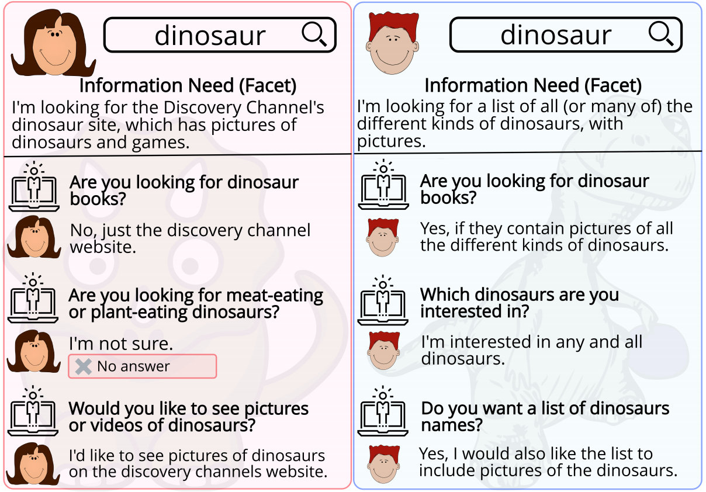

两人都输入了“恐龙”一词，但是其**信息需求(information need)**/想要查询的**方面(facet)**是不同的。在模型没有任何先验的情况下，系统问的第一个问题是一样的，然而后面系统所问的问题会根据用户的回答而发生改变。

search clarification的**一种**工作流如下：

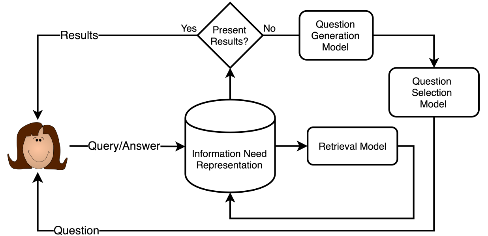

首先，用户**将query输入系统中**以初始化对话的进行；此后，系统**检索出一个文档列表并评估其置信度(在Present Results?模块)**，如果系统没有足够的信心将结果呈现给用户，则它开始询问问题的过程；类似第一步，系统**问题生成模块(question generation model)**生成一个候选问题列表；然后，系统**问题选择模块(question selection model)**在候选列表中选择一个最佳问题，并向用户提问；基于用户的回答，系统重新检索出一个新的文档列表，并重复以上过程。

#### 6.1.2 相关工作

澄清式检索以**对话式搜索(conversational search, form 1987)**为根源，是自然语言处理与信息检索两个领域的交叉研究方向。

自然语言处理相关工作：对话机器人、问答系统、预训练语言模型等。

信息检索相关工作：检索结果排序、对话式检索、查询建议、检索结果多样化与个性化等。

#### 6.1.3 问题描述

在本文所做的工作中，**问题生成模块的实质是从一大堆问题中选择出一个问题列表**，而不是使用生成式模型生成多个问题。虽然这个做法不完全现实，但这样做的好处是便于对模型进行**线下评估(offline evaluation)**。

本文使用TREC数据集提取数据。TREC共发行了**200个搜索主题(topic)**，其中每个主题都是**模糊的(ambiguous)**或者**片面的(faceted)**。二者的定义如下：**“... Ambiguous queries are those that have multiple distinct interpretations. ... On the other hand, facets reflect underspecified queries, with different aspects covered by the subtopics...”**。

形式化上，令$\mathcal{T}=\{t_{1}, t_{2}, \cdots, t_{n}\}$为**主题(即用户可能输入的查询)的集合**，每个主题将对用户和系统的对话过程进行初始化。此外，定义$\mathcal F=\{\boldsymbol f_1, \boldsymbol f_2, \cdots,  \boldsymbol f_n\}$为信息需求/方面(facet)的集合，其中$\boldsymbol f_i = \{f_{1}^{i}, f_{2}^{i}, \cdots, f_{m_{i}}^{i}\}$为主题$t_i$的$m_i$个方面。令$\mathcal Q=\{\boldsymbol q_1, \boldsymbol q_2, \cdots,  \boldsymbol q_n\}$为澄清问题(clarifying question)集合，其中$\boldsymbol q_i = \{q_{1}^{i}, q_{2}^{i}, \cdots, q_{z_{i}}^{i}\}$为主题$t_i$的所有澄清问题，$z_i$为主题$t_i$的澄清问题数。

值得注意的是，在将TREC Web数据细分到各个facet之后，我们还借用了它们的**相关性评估**。例如，假设主题“恐龙”有10个相关文档，其中6个被标记为与第一个方面相关，而4个与第二个方面相关。**在Qulac中，主题“恐龙”分为两个topic-facet对(恐龙-第一个方面、恐龙-第二个方面)以及它们各自的相关性判断(相关性文档越多，评分越高)**，以用于**后期模型的评分训练**。

#### 6.1.4 数据采集

本文提出了**Qulac数据集**，制作数据集的过程如下：

(1) **Topics and Facets**：使用TREC Web track 09-12数据集中的198个topics，然后将其分为多个facets(原文中是762个，平均每个topic有3.85个facets)，每个facet描述了用户的一种信息需求。因此，对于每个topic-facet对，还需要进行**各个facet的相关性判断**。

(2) **Clarifying Questions**：作者邀请了多名标注人员，使其模仿对话代理的行为。标注人员**根据已有的各topic包含的意图或搜索引擎自动生成的查询推荐为依据**，为各查询提出澄清式问题。

(3) **Question Verification and Addition**：通过标记人员检查，保证每个clarifying question的质量，并保证每个facet至少有一个及以上的question能够覆盖。

(4) **Answers**：作者邀请另一组标注人员，针对**每一个澄清式问题**，在**给定查询和意图描述**的情况下，手动编辑问题答案。

完成后的Qulac数据集的统计信息如下：

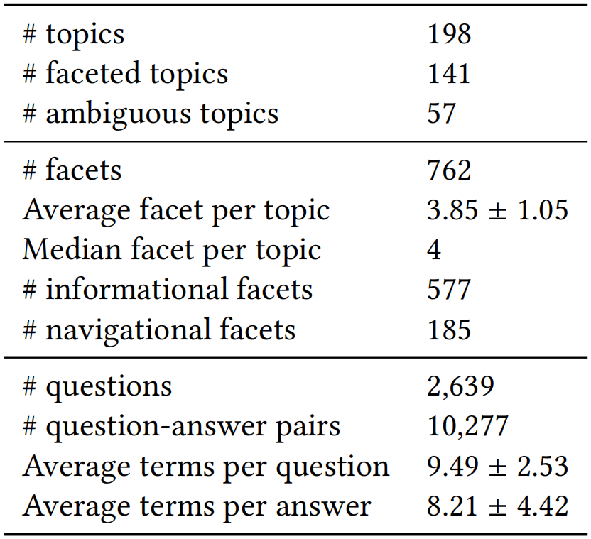

#### 6.1.5 选择澄清问题

形式上，对于一个给定的主题$t$，令$\boldsymbol h =\{(q_1,a_1),(q_2,a_2),\cdots,(q_{|\boldsymbol h|},a_{|\boldsymbol h|})\}$为系统和用户之间的对话历史(即对话上下文)。在这里，模型的目标是预测$q$，即系统应向用户提出的下一个问题。此外，设$a$为用户对$q$的回答，问题选择模型不知道答案$a$，但是一旦系统接收到答案$a$，文档检索模型就会检索文档。接下来，我们描述**问题检索模型(可以看做是一种问题生成模型)**，然后介绍**问题选择模型**和**文档检索模型**。

### 6.1.5.1 Question Retrieval Model

本文设计的问题检索(生成)模型为**BERT-LeaQuR(BERT Language Representation based Question Retrieval model, 基于BERT语言表示的问题检索模型)**。形式上，BERT-LeaQuR模型估计**问题相关概率**$p(R=1|t,q)$，其中$R$为一个二值随机变量，表示表示问题$q$应当被选择($R=1$)与否($R=0$)，$t$和$q$分别对应topic(query)以及候选问题。在BERT-LeaQuR模型中，该概率以下式进行估计：
$$
p(R=1|t,q)=\psi(\phi_T(t), \phi_Q(q))
$$
其中组件$\phi_T(t)$和$\phi_Q(q)$分别为topic和question的**表示**，$\psi$是匹配组件，输出一个问题检索分数。以上三个函数有许多的定义方式，在本文中，$\phi_T(t)$和$\phi_Q(q)$使用BERT模型进行学习，其中BERT模型是预训练好的，并在Qulac数据集上进行3个轮次的fine-tuning。

组件$\psi$使用一个全连接神经网络进行建模，输出维度是2，并在隐含层使用ReLU激活函数，输出层使用softmax激活函数。整个模型相当于一个**二分类器**，使用不同的topic、question以及question的反例进行二分类训练(损失函数为交叉熵)，将分类结果为$R=1$的文档挑选出来。

值得注意的是，问题检索(生成)部分并不涉及用户和系统的对话上下文。

##### 6.1.5.2 Question Selection Model

本文设计的问题选择模型为**NeuQS(Neural Question Selection)**，其利用了许多信息来源。详细地，给定查询$t$，问题$q$以及对话上下文$h$，NeuQS输出**相关性分数**：$\text {score}=\gamma(\phi_{T}(t), \phi_{H}(\boldsymbol{h}), \phi_{Q}(q), \eta(t, \boldsymbol{h}, q), \sigma(t, \boldsymbol{h}, q))$，其中，$\gamma$为得分函数，$\phi_T(t)$为query的表示，$\phi_H(\boldsymbol h)$为对话上下文的表示，$\phi_Q(q)$为问题的表示，$\eta(t,\boldsymbol h,q)$为**检索表示**，$\sigma(t,\boldsymbol h,q)$为**查询表现表示**。其中的每个组件都可以用很多种方式进行实现。在本文中，$\phi_T$和$\phi_Q$的模型与BERT-LeaQuR一致，$\phi_H$用下式进行表示：
$$
\phi_{H}(\boldsymbol{h})=\frac{1}{|\boldsymbol{h}|} \sum_{i}^{|\boldsymbol{h}|} \phi_{QA}(q_{i}, a_{i})
$$
其中$\phi_{QA}(q,a)$是问题$q$和答案$a$的embedding函数。

此外，检索表示$\eta(t,\boldsymbol h,q) \in \mathbb R^k$通过对查询、上下文和问题的检索分数进行插值获得(见Documents Retrieval Model部分)，其中top k个检索的文档被用来计算该分数。最后，查询表现表示$\sigma(t,\boldsymbol h,q) \in \mathbb R^k$使用$\sigma-\text{OPP}$模型进行实现。

为了对函数$\gamma$进行建模，将以上提到的所有组件进行**拼接(concatenate)**，并输入到一个含两个隐含层的全连接神经网络中。在隐含层中使用ReLU激活函数，并**使用信息检索中的pointwise learning方式对问题列表进行排序学习**。**问题选择任务的训练标签基于IR任务的性能**。例如，假设询问Q1之后的文档检索性能nDCG@20为0.7，而询问Q2之后nDCG@20值为0.3。则Q1是一个更好的问题，其在标签中得分比Q2更高。

##### 6.1.5.3 Documents Retrieval Model

文章使用**基于语言建模框架的KL散度检索模型**进行文档检索。对于原始查询$t$、对话上下文$\boldsymbol h$、当前问题$q$以及回答$a$中的每个词项$w$，有下式：
$$
p(w|t, \boldsymbol{h}, q, a)=\alpha \times p(w|\theta_{t})+(1-\alpha) \times p(w|\theta_{\mathbf{h}, q, a})
$$
其中，$\theta_t$表示原始查询的语言模型，而$\theta_{\boldsymbol h,q,a}$表示所有问题和答案的语言模型。$\alpha$是一个控制开关，**决定查询以及对话上下文的权重，作为一个超参数，在验证集上进行调整**。然后，文档$d$的得分利用下式进行计算：
$$
p(d|t, \boldsymbol{h}, q, a)=\sum_{w_{k} \in \tau} p(w_{k} | t, \boldsymbol{h}, q, a) \log (p(w_{k} | d))
$$
其中，$\tau$是对话中出现的所有词项的集合。

#### 6.1.6 实验

(1) 数据集：实验按照分别对topics和facets进行数据集划分，产生了两种数据，即**Qulac-T和Qulac-F**。

(2) 问题检索(生成)的评估指标：MAP、Recall@10、Recall@20、Recall@30。

(3) 问题选择的评估指标：MRR、P@1、nDCG@1、nDCG@5、nDCG@20。

(4) 用于比较的方法：BM25、RM3、QL、LambdaMART、RankNet用于问题检索(生成)的比较；Original Query、$\sigma-\text{QPP}$、LambdaMART、RankNet、Best Question及Worst Question用于问题选择的比较。

(5) 问题检索(生成)实验结果(该结果的评估对象为question generation model产生的候选澄清问题列表)：

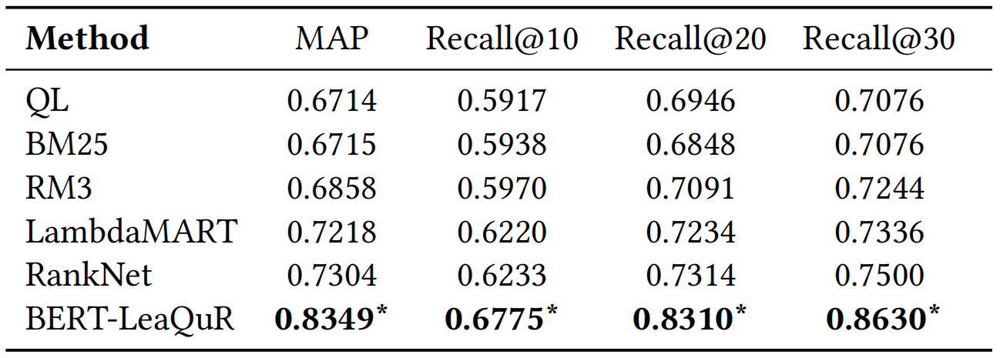

(6) 问题选择实验结果(该结果的评估对象为document retrieval model产生的文档列表，**问答轮数为1**)：

(7) 对话轮次对实验结果的影响：

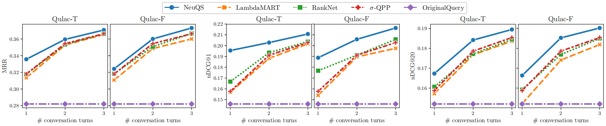

### 6.2 澄清问题的生成模型

#### 6.2.1 简介

论文[2]的用户调查结果显示，在互联网搜索中，用户喜欢看到澄清问题的出现，不仅是因为其功能性作用，还因为其情感作用。换句话说，这些问题会使得用户在搜索时更有信息，因为搜索引擎看起来会更加智能。

下图展示了本文所使用的澄清问题提问方式，用户通过选择候选答案的方式进行回答，这点与[1]中用户通过自然语言进行回答的方式存在差异。

在以前关于澄清式搜索的研究工作中，论文[1]提出了一种从大量问题集合中选择一个问题向用户提问的方式，然而在现实的系统中，如何**生成**澄清问题是主要的挑战。其建模难度以及数据集的缺失使得其挑战性很高。

在本文中，我们通过提出使用**弱监督**进行训练的问题生成模型来应对生成澄清问题的挑战。我们相信，如果系统知道查询的不同**方面(facet)**，则可以产生一个很好的澄清性问题。因此，我们建议使用**查询重构数据**来识别不同的查询方面。更详细地说，我们首先使用Bing搜索引擎收集的数据进行了大规模查询日志分析，以识别开放域信息检索中所需的**不同澄清类型的分类法(taxonomy)**。我们尝试针对不同的澄清问题类型生成不同的澄清问题，这让我们理解到，**可以使用少量问题模板来表示许多澄清问题**。基于这种观察，我们提出了一个简单而有效的基于规则的模型，用于选择预定义的问题模板。这个基于规则的模型使用查询的facets和查询entity type信息来生成澄清问题。我们进一步提出使用基于规则的模型生成的数据的机器学习模型。实际上，基于规则的模型会产生弱的监督数据，以训练我们的问题生成模型，该模型是基于递归神经网络的序列到序列模型。我们还建议使用**强化学习**算法进一步训练模型，该算法的奖励函数是估计澄清效用的不可微函数。

除了澄清问题之外，我们还提出了一种解决方案，可以**针对给定的一对查询和澄清问题生成候选答案**。我们模型的目标是单调子模函数，它使我们能够使用有效的贪婪近似算法进行优化。**直观地，我们的模型在查询的上下文中选择对于给定的澄清问题来说是好的答案的短语**。

文章使用**人工评价(human evaluation)**的方式来评估模型。

#### 6.2.2 用户调研

论文对用户对澄清问题的态度进行了细致的调研，结果汇总如下：

(1) 在对话式信息搜索中，向用户提问问题是澄清用户信息需求是最便利的交互过程，其对于小屏幕或者无屏幕(仅提供语音搜索)的系统尤为重要。

(2) 澄清窗格(clarification pane)对于用户十分重要，其蕴含着功能性和情感性两重作用。

(3) 大型在线实验结果表明，与普通的查询建议相比，询问澄清问题使得相对点击率提高了48％以上，这表明在网络搜索中澄清问题非常有用。

#### 6.2.3 澄清问题的分类法

论文研究了从Bing查询日志(尤其是**查询重构数据**)中抽样的成千上万个查询格式，并得到了澄清问题的一种分类法，如下：

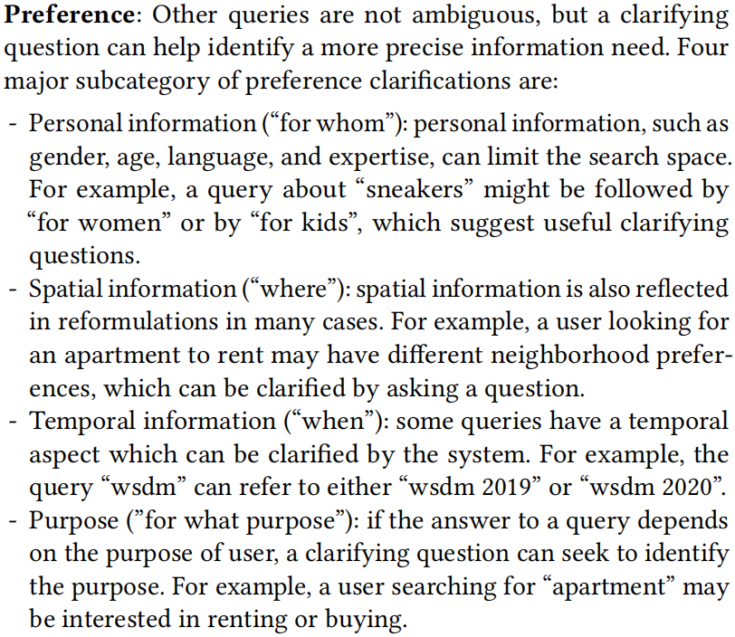

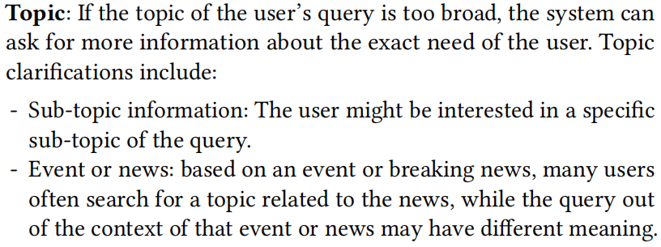

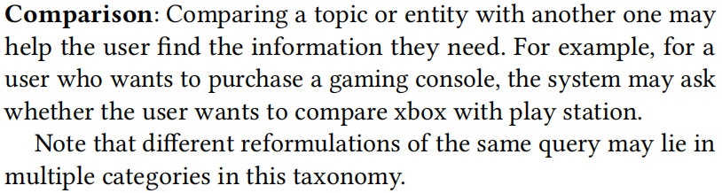

#### 6.2.4 生成澄清问题

给定不同的澄清问题类型，在本节中我们介绍三种生成澄清问题的方法。第一种方法RTC是一种简单但是有效的基于规则的**槽位填充算法(slot filling algorithm)**；第二种方法QLM是基于seq2seq机制的文本生成模型；第三种方法QCM是基于强化学习的模型。由于人为创建大规模的澄清问题需要极大的开销，因此三种模型都不依赖监督学习。事实上，**QLM和QCM基于第一种方法产生的弱监督数据进行训练**。

##### 6.2.4.1 Query Aspects Generation

为了生成澄清问题，必须定义澄清问题的不同**方面(aspects)**。本文使用**查询重构数据**来揭示查询的不同方面。通过用户查询日志分析可以看出，大多数用户通过添加词项的方式来重构其查询，这种方式叫做specialization。可以在大规模查询日志中提取出许多三元组$(q,qq',c)$或$(q,q'q,c)$，该三元组表示用户在一个查询session中输入了查询$q$，接着又输入了查询$qq'$或$q'q$，这种情况发生的频率为$c$(对所有用户求和)。

使用神经协同过滤(NCF)解决查询重构的稀疏性问题，即补全可能确实的重构信息。通过训练NCF模型，每个查询的每个重构都有一个$weight$。最后，可以通过下式计算每个查询的方面的概率分布：
$$
p(q \rightarrow q')=\frac{weight(q,q')}{\sum_{q''}weight(q,q'')}
$$

##### 6.2.4.2 RTC: A Template-based Approach

RTC是一种简单但有效的基于规则的模型。根据澄清问题的分类法，我们提出了以下五种问题模板：

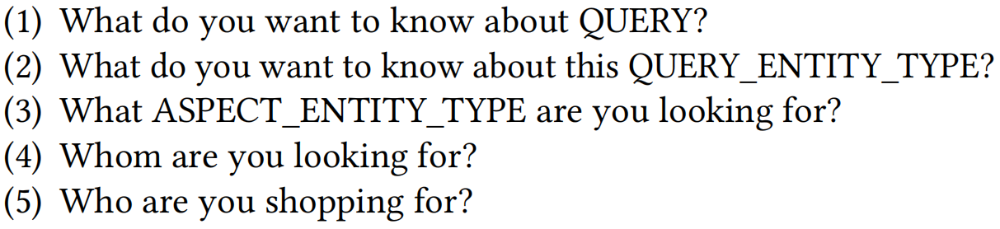

对于每个查询，首先计算三个变量：(1) QUERY：查询的字符串；(2) QUERY_ENTITY_TYPE：查询的实体类型；(3) ASPECT_ENTITY_TYPE：该查询对应的大多数方面的实体类型。如果的实体类型为et的查询方面百分比超过$\tau$，则将该变量的值设置为et。使用如下所示的基于规则的算法来选择一个问题模板：

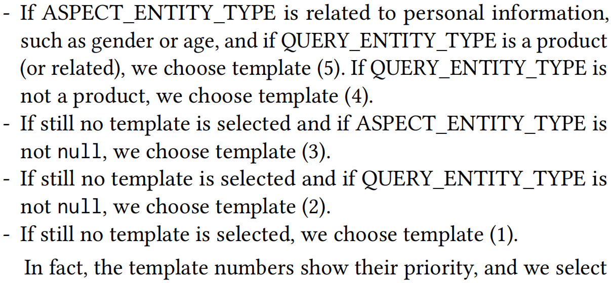

##### 6.2.4.3 QLM: Question Likelihood Maximization

QLM是一个弱监督的神经生成模型，其网络结构如下所示：

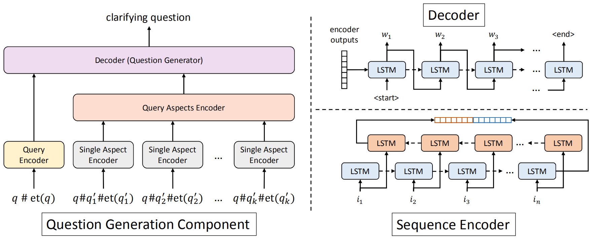

每个模块的解释如下：

(1) **Query Encoder**：将当前查询$q$以及查询的实体类型$\text{et}(q)$作为输入，并返回一个该查询的$d$维表示向量。

(2) **Single Aspect Encoder**：对查询$q$的每个aspect $q'$，该模块学习一个表示。每个encoder的参数是共享的。

(3) **Query Aspects Encoder**：对于查询$q$，选取$k$个概率最大的aspects(基于重构数据进行排序)，并转换为一个高维的表示向量。该模型使用**BiLSTM**进行实现(如上图右半部分所示)，也可以被替换成Transformer等结构。

该模型的训练数据为RTC模型产生的澄清问题，被看做是**弱监督数据**。与传统seq2seq模型一样，解码器在训练时模型采用teacher forcing方式，测试时采用自回归方式。

##### 6.2.4.4 QCM: Query Clarification Maximization

QCM是一种基于强化学习的模型，其学习目标是**最大化效用函数(不可导)**。其框架如下所示：

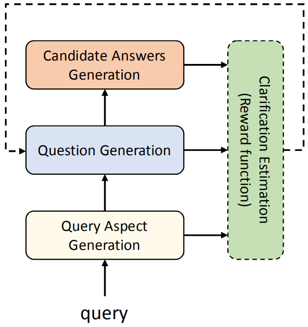

可以看出，**该模型同时生成澄清问题和候选答案，奖励函数(reward function)衡量了澄清效果**。在该框架中，查询方面生成(query aspect generation)模块与6.2.4.1一致；澄清问题生成(question generation)模块与6.2.4.3一致；候选答案生成(candidate answers generation)模块与6.2.4.5一致。

文章首先预训练QLM模型使其能够生成澄清问题，然后再使用REINFORCE算法优化损失函数：
$$
L=-(r(q^{*})-r(q_{Q L M}^{*})) \sum_{t=1}^{T} \log p(q_{t}^{*} | q_{1}^{*}, \cdots, q_{t-1}^{*})
$$
其中，$r(\cdot)$是奖励函数，$q^*_{QLM}$是QLM模型生成的问题，$q^*$是QCM模型生成的问题，$T$是序列长度。论文希望提出的问题$q^*$澄清查询$q$意图的概率$p(c=1|q,q^*)$最大，根据全概率公式，该概率在给定候选答案集合$A$和意图集合$I_q$的情况下计算方法如下：
$$
\begin{aligned}
p(c=1 | q, q^{*})=&\sum_{a \in A} p(c=1 | a, q, q^{*}) p(a | q, q^{*})\\
p(c=1 | a, q, q^{*})=&\sum_{i \in I_{q}} p(c=1 | i, a, q, q^{*}) p(i | a, q, q^{*})
\end{aligned}
$$
其中$c$是一个二值随机变量。所提及的概率计算方法如下：

(1) $p(i|a,q,q^*)$：该部分仅取决于查询和意图，与提出的问题和候选答案相独立，故可使用NCF算法得到每一aspect的概率分布$p(q \rightarrow i)$替代。

(2) $p(c=1 | i, a, q, q^{*})$：该部分取决于**答案和意图的匹配程度**，由两者词向量余弦相似度平均值计算得到：
$$
p(c=1 \mid i, a, q, q^{*})=\left\{\begin{array}{ll}
\operatorname{sim}(a, i) & \text { if } a=\arg \max _{a^{\prime} \in A} \operatorname{sim}(a^{\prime}, i) \\
0 & \text { otherwise }
\end{array}\right.
$$
(3) $p(a | q, q^{*})$：该部分使用query text、query entity type和answer entity type计算，构造输入以上三者输出所有候选答案的类word2vec模型。具体实现候选答案和answer entity type可用新增查询词项$q'$及其entity type替代。

##### 6.2.4.5 Candidate Answer Selection

对于每个澄清问题，生成$m$个候选的答案是很重要的。本文提出了一种一个一个生成候选答案的贪心算法CAS：对于生成候选答案的每一步$i(i < m)$，如果相对于前一步的效用增长小于阈值$\tau$，就停止候选答案的选择，将已选择的答案的集合作为当前澄清问题的候选答案。

#### 6.2.5 实验

实验采用**人工评价**的方式，对澄清问题的质量、候选答案的质量以及点击候选答案后第二结果页的质量进行评价。

### 6.3 用户交互行为的分析与学习

#### 6.3.1 简介

论文[3]认为，分析用户与澄清问题的交互行为，能够更好地理解澄清式检索，并且帮助研究人员认识到哪些查询需要澄清、哪些澄清问题更受用户喜爱。基于这样的动机，该论文基于几百万个不同的查询，重点研究了用户与澄清问题的交互行为。该研究基于一个相对新颖的特征：**澄清窗格(clarification pane)**，如下所示：

值得注意的是，与[2]相同，在该工作中，**用户直接在候选答案中进行选择**，而不是使用输入框输入一段文字来回答澄清问题，这一点与[1]存在根本差异。

文章**根据澄清窗格的不同属性，通过澄清问题来分析用户参与度**，此外还研究了当查询属性(查询长度、类型等)不同时用户的交互行为。文章进一步研究了澄清窗格中的**点击偏差(click bias)**问题。这些所分析的问题对如何改进澄清式检索进行了一定启发。

基于文章中对用户交互的分析，本文提出了一种表示学习模型，用于表示澄清问题以及其候选答案。该模型包含两个主要组件：intents coverage encoder和answer consistency encoder，模型完全基于注意力机制进行设计。

#### 6.3.2 用户交互的分析

##### 6.3.2.1 数据采集

首先获取Bing搜索引擎的**澄清窗格的点击数据(clickthrough data)**。对于一些查询，数据中包含多个澄清窗格，并向不同的用户集合进行展示。这些澄清窗格的不同取决于澄清问题、候选答案集合甚至是候选答案集合的顺序。**更多生成澄清窗格的信息参考论文[2]**。

收集的数据包括超过7460万的澄清窗格印象(即向用户显示的澄清窗格的次数)，包含超过550万个不同的查询。每个澄清窗格的候选答案的平均数量为2.99。 下表报告了数据的统计信息。值得注意的是，本文仅关注具有**至少10次展示**的查询-澄清对。

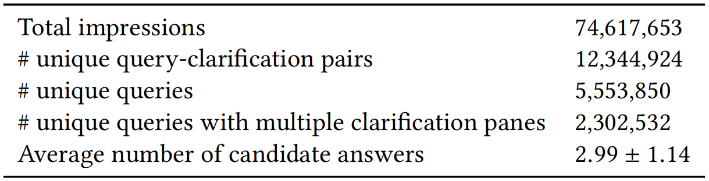

##### 6.3.2.2 研究问题

研究问题一：什么样的**澄清问题**能够更受到用户的关注(产生点击行为)？(6.2.2.3)

研究问题二：对于什么样的**查询**，用户更加喜欢进行澄清？(6.2.2.4)

研究问题三：澄清式检索对于用户的**搜索体验**有什么影响？(6.2.2.5)

##### 6.3.2.3 分析澄清问题对澄清窗格受用户关注程度的影响

(1) 从**问题模板类型**的角度进行分析

许多澄清问题的类型可以使用一些**预先定义的问题模板**进行表示。本文定义了Bing数据中所有问题模板的类型，并根据数据得到平均关注度，如下：

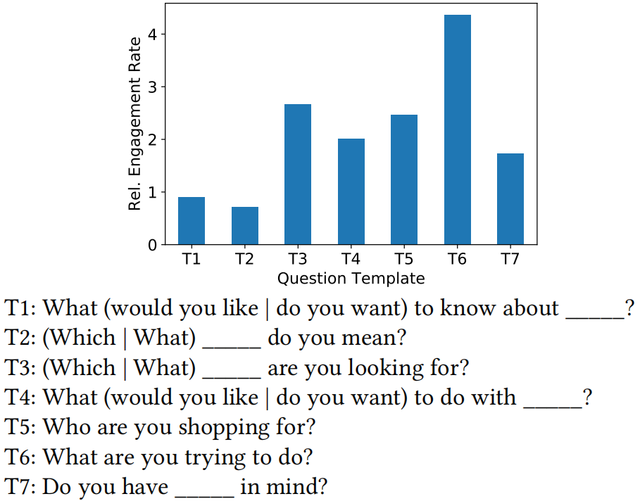

该图中，问题出现的频率由高到低排列。可以看出，一些**泛化的问题模板**(例如T1)具有较高的频率，但是用户的点击率并不高；另一方面，**更加具体的问题模板(例如T6)能够取得更高的关注度**。

(2) 从**候选答案个数**的角度进行分析

关注度随候选答案个数的变化如下表所示：

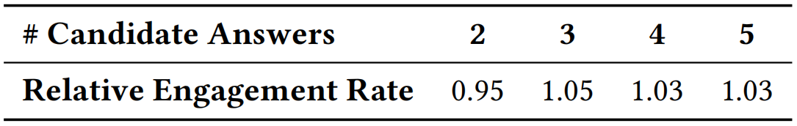

可以看出，当候选答案数量为2时，用户的关注率略低。这可能是因为2个答案无法覆盖澄清问题的所有方面导致的。总的来说，候选答案个数对用户的关注率影响不大。

(3) 从**点击分布**的角度进行分析

使用有5个候选答案的数据进行统计，得到点击分布的熵与用户参与度的关系如下：

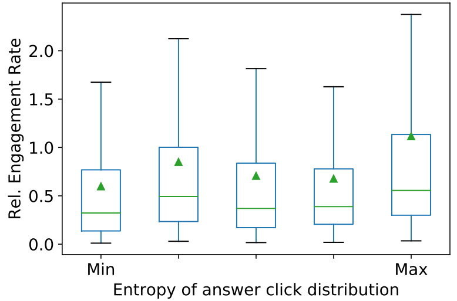

从图中可以看出，问题答案点击分布的熵最大或中等水平时，用户参与程度最高。其中，熵最大时对应的查询应当是十分模糊的查询，而熵位于中等水平时的查询也是模糊的，但其具有一个**主导的含义**。例如搜索“Windows”时，大多数用户都会选择点击“Windows 10”，这种选择是随着时间而改变的。

##### 6.3.2.4 分析查询对澄清窗格受用户关注程度的影响

(1) 从**查询长度**的角度进行分析

通常，长的查询更难返回高质量的文档列表。一个原因是，长的查询在历史数据中出现的频率更低。然而有趣的是，随着查询长度的增加，用户对澄清窗格的平均关注率会更高：

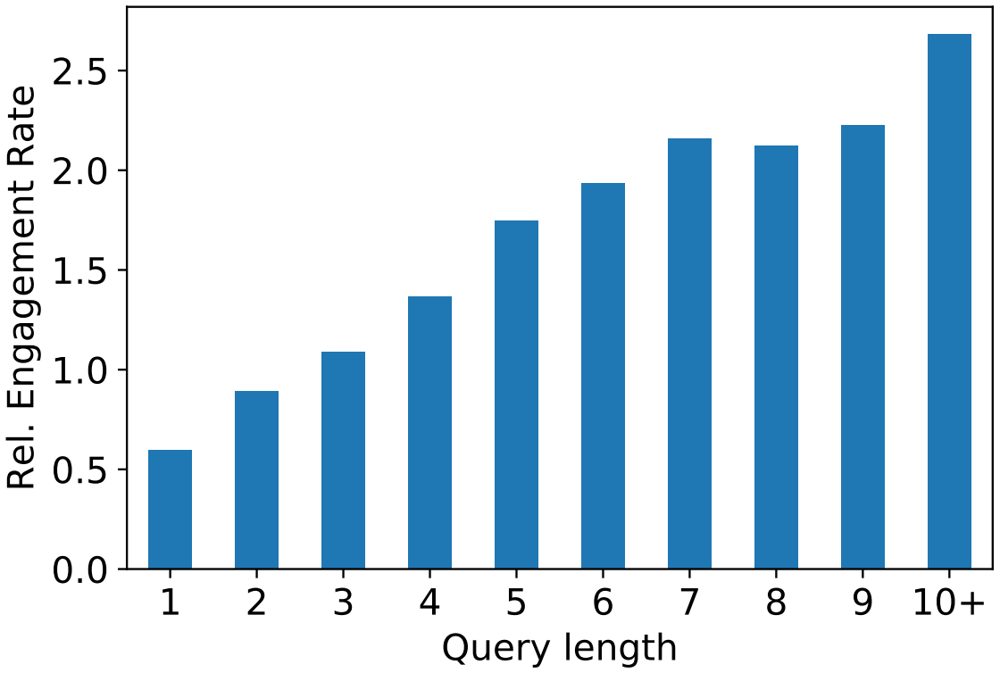

(2) 从**查询类型**的角度进行分析

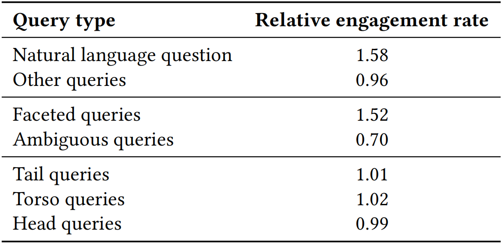

从上表可以看出，当用户输入的查询是**自然语言**时，用户更易参与澄清窗格的点击行为；**片面的查询通常比模糊的查询更易获得用户的参与行为**。

(3) 从**历史点击数据**的角度进行分析

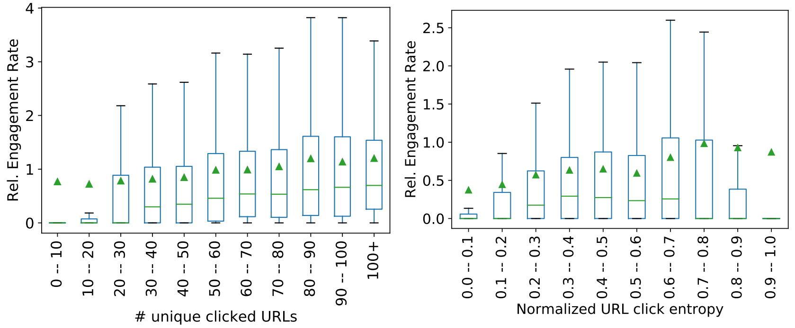

可以看出，对于一个特定的查询，被点击的URL数量和点击分布的熵越大时，用户参与程度越高。

##### 6.3.2.5 分析澄清的影响以及质量

邀请标注人员针对使用澄清式问题前后的页面进行满意度层面打分(good, fair, bad 三个等级)。结果发现使用澄清式问题后，用户的满意度显著提高。

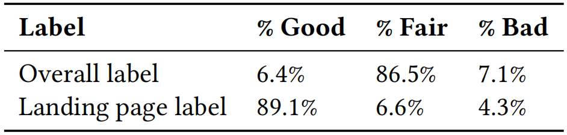

#### 6.3.3 利用用户交互数据改进澄清过程

搜索澄清的一项基本任务是对不同模型在不同假设下产生的澄清问题进行重新排名和选择。论文[2]中提出了一些澄清的问题生成模型。基于对用户交互行为的分析，本文提出了以下用于对澄清问题进行重排的特征：(1) 问题模板(一种类别特征)；(2) 查询长度；(3) 查询类型；(4) 候选答案个数；(5) 被点击的不同URL的数量；(6) URL的点击熵。为了衡量澄清窗格澄清不同查询意图的程度，我们可以使用[2]中介绍的**澄清估计模型(clarification estimation model)**。本文提出一个模型对问题选择进行训练，该模型主要在用户的交互数据上进行训练，然后在一小部分认为标记的数据上进行微调。

令$T$为训练数据集，其中包含很多三元组$(q,C,L)$，其中$q$代表一个独一无二的**查询**，$C=[c_1,c_2,\cdots,c_m]$为针对该查询的$m$个**澄清窗格**的集合，$L=[l_1,l_2,\cdots,l_m]$为与每个澄清窗格对应的**标签(即点击信息或者人工标签)**。每个澄清窗格$c_j$包含一个澄清问题$q^*$以及$K$个候选答案的列表$A=[a_1,a_2,\cdots,a_K]$，在本文中$K=5$。此外，定义$I_q$为查询$q$对应的$n$个**意图(intent)**的集合，其第$j$个元素是一个二元组$(i_j,w_j)$，$i_j$代表一个意图，$w_j$代表该意图的权重。注意，查询意图集通常是**系统未知的**，但是有一些基于查询日志和点击数据来**估计意图集的方法**。我们的目标是为每个**查询-澄清对(query-clarification pair)**训练一个表示学习模型，该模型可以用于对澄清窗格进行选择或重排。

##### 6.3.3.1 澄清的表示学习

整个学习模型**RLC(representation learning for clarification)**如下所示：

(1) **Intents Coverage Encoder**：将查询$q$、候选答案集合$A$和意图$i_j$拼接输入**BERT模型(图中的Text Encoder)**，并使用意图权重$p(i_j|q)$作为注意力分数生成**意图覆盖表示**$R^{(ICE)}$。

(2) **Answers Consistency Encoder**：将澄清问题$q^*$、候选答案$a_j$以及其实体类型$e_j$拼接输入**BERT模型(图中的Text Encoder)**，再经过一个Transformer层，得到**答案一致性表示**$R^{(ACE)}$。

(3) **Label Prediction**：将$R^{(ICE)}$和$R^{(ACE)}$进行拼接，输入到一个前馈神经网络中，该网络的输出层只有一个神经元，代表给定的query-clarification question pair的得分情况，用于pointwise学习。

(4) **Text Encoder**：本文使用BERT-base作为Text Encoder，在训练过程中对BERT的参数进行微调。

(5) **The Intent Set** $I_q$：本文采用Bing搜索引擎中的**查询重构数据**以及**文档点击数据**对查询$q$的意图$I_q$进行估计。对于查询重构数据$(q, q',w)$，使用包含原始查询$q$的重构后的查询$q'$作为一个查询意图；对于点击数据，将用户点击URL的文档标题用作查询意图估计。

##### 6.3.3.2 训练

文章采用**pairwise**的方式进行排序学习，首先使用Bing的点击数据进行大规模的训练，然后使用人工标记的较小的数据集进行模型参数的微调。

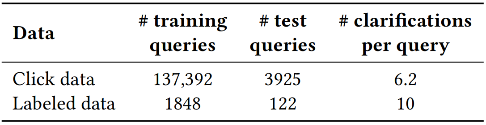

##### 6.3.3.3 实验结果

实验进行点击数据关注度提升的评估、标记数据的评估以及人工评估。注意，这里**labeled data中的指标针对的是澄清问题(或clarification pane)，而不是像[1]中针对最终检索的文档列表结果**。

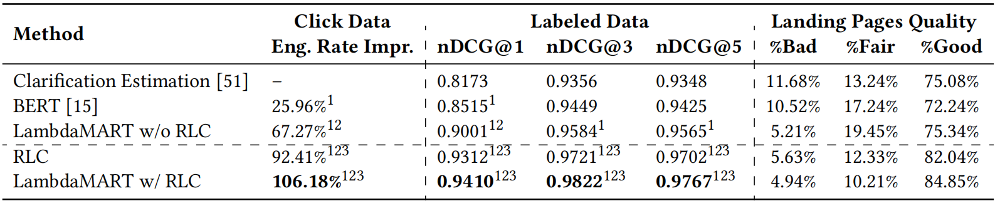

### 6.4 用于对话式搜索的Guided Transformer

#### 6.4.1 简介

论文[4]提出了一种神经网络结构，通过使用多种信息源来学习用户和系统之间对话的准确表示。该神经网络结构基于Transformer，同时使用外部信息资源进行引导，因此称为**Guided Transformer(GT)**。外部信息源包含排名靠前的被检索文档，以及与查询可能相关的不同澄清问题的集合。

论文训练GT模型完成两种下游任务：**文档检索**和**下一个澄清问题的选择**。在文档检索任务中，模型考虑用户和系统之间的对话，并对文档进行打分；下一个澄清问题的选择任务专注于选择使得搜索质量变得更高的下一个向用户提问的任务。

#### 6.4.2 模型

##### 6.4.2.1 问题形式化

令$Q=\{q_1,q_2,\cdots,q_n\}$为训练查询集合，$F_{q_i}=\{f_{1q_i},f_{2q_i},\cdots,f_{nq_i}\}$表示与查询$q_i$相关的所有**方面(facets)**的集合。整个对话可以表示为$C=<q_i,c_1,a_1,c_2,a_2,\cdots,c_t,a_t>$，其中$c_i$和$a_i$分别代表系统提出的第$i$个澄清问题以及用户相应的回答。本文所提出模型的目标是，通过以下两个任务，为给定的对话$C$学习出准确的向量表示：

(1) **文档检索**：每个训练实例包含用户和系统的对话$C=<q_i,c_1,a_1,c_2,a_2,\cdots,c_t,a_t>$，**一个文档以及一个相关性分数**。

(2) **下一个澄清问题的选择**：每个训练实例包含用户和系统的对话$C=<q_i,c_1,a_1,c_2,a_2,\cdots,c_t,a_t>$，一个候选澄清问题$c$以及一个与$c$相关的标签。该标签基于**询问用户**$c$**后的文档检索质量进行计算得到**。

令$S_{q_i}=\{s_{1 q_i},s_{2 q_i}, \cdots, s_{m q_i}\}$为查询$q_i$的一系列外部信息资源，其中，$s_{j q_i}$是**一段文本**。

##### 6.4.2.2 Guided Transformer结构

Guided Transformer的网络结构如下所示：

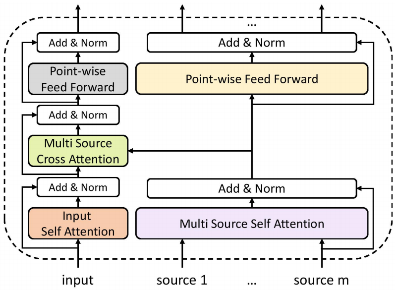

其中，input代表一个输入序列，即$C=<q_i,c_1,a_1,c_2,a_2,\cdots,c_t,a_t>$的向量表示，source 1~$m$为$m$个不同的文本外部信息资源的向量表示，每个资源是一个序列的集合。

##### 6.4.2.3 模型训练

模型采用**多任务学习(MTL)**的方式进行训练，其中**主任务**为文档检索或下一个澄清问题的预测，**辅助任务**在本文使用intent description identification。也可以使用**单任务学习(STL)**方式，只使用主任务来训练模型。使用BERT进行文本的表示，在多任务学习方式中，需要向BERT的输入中加入task embedding，以区分不同的学习任务。

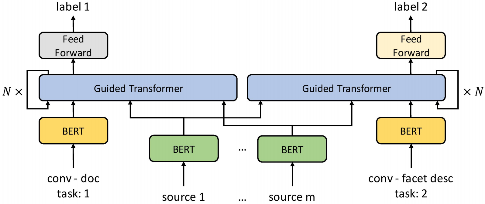

训练时，将用户的查询、用户与系统的对话进行连接，并用[SEP]进行分隔。对于文档检索任务，输入数据再将目标的检索文档进行连接；对于下一个澄清问题的预测任务，输入数据再将目标的下一个澄清问题进行连接。因此，对于文档检索任务，整个模型的输入为：[CLS]  query tokens [SEP] clarifying question tokens [SEP] user response tokens [SEP] document tokens [SEP]，**输出为该文档对应的分数**；对于下一个澄清问题的预测任务，整个模型的输入为：[CLS]  query tokens [SEP] (clarifying question tokens [SEP] user response tokens [SEP])的重复 next question tokens [SEP]，**输出为该澄清问题对应的分数**。

#### 6.4.3 实验

对于文档检索任务，实验使用Qulac数据集。文档检索结果如下所示，在该实验中，仅使用单轮对话，Docs代表使用前10个检索的文档，CQs代表前10个澄清问题，作为外部资源：

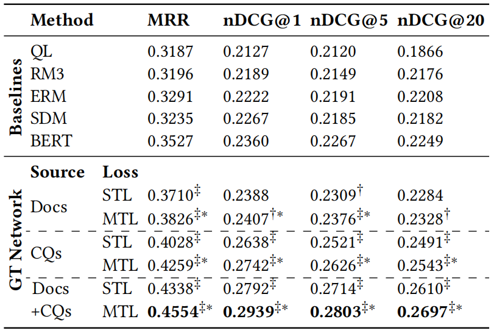

下一个澄清问题的预测任务是在给定用户和系统对话的条件下预测向用户提问的下一个问题。本文使用三轮对话，并求各个指标的平均值，并**使用查询相似度作为后续检索模型**。该任务的评价结果如下所示：

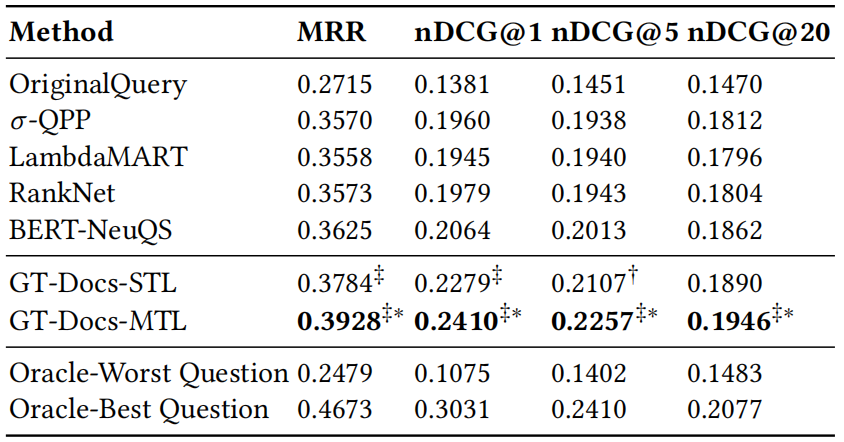

### 6.5 MIMICS数据集

在论文[1-4]中，都没有涉及大规模的澄清式检索专用数据集。**Qulac**[1]是目前已知的唯一专注于澄清式检索的公开数据集，但**其仅仅包含200个不同的查询(来源于TREC Web Track 2009-2012)**，因此其无法用于训练参数较多的机器学习模型。**MIMICS数据集[5]是从Bing搜索的日志中采样的专门用于检索澄清的数据集**。MIMICS中的每个澄清窗格都是通过Bing获取的，每个窗格包含一个澄清问题和最多五个候选答案。

MIMICS包含三个数据集：(1) **MIMICS-Click**：包含超过400k个不同的查询、其对应的澄清窗格(**与查询一对一**)以及对应的用户交互信号(如点击行为)；(2) **MIMICS-ClickExplore**：一个扩展数据集，包含60k个不同的查询以及对应的用户交互信号，与MIMICS-Click不同的是，**每个查询对应多个澄清窗格**；(3) **MIMICS-Manual**：包含2k个不同的查询，每个query-clarification对都被人工进行了质量标记，其中包含对**澄清问题、候选答案集以及对每个候选答案的落地结果页的质量评价**。

MIMICS目前已经开放(https://github.com/microsoft/MIMICS)，可用于clarification generation、clarification selection、user engagement prediction等与search clarification相关的任务。值得注意的是，有一些与对话式检索相关的数据集已经被发行，例如**CCPE-M、CoQA、QuAC、MISC**。虽然这些数据集不关注澄清式搜索，但是也可以与MIMICS产生关联，并可以用于未来的研究中。此外，公共的查询日志，例如**AOL数据集**，也可以与MIMICS共同用于未来的研究工作。

在MIMICS数据集中，澄清问题以及候选答案都是使用一系列内部算法或者机器学习模型产生的，**其生成过程主要基于用户与搜索引擎的交互(如查询重构及点击)、内容分析、实体类型和关系等要素**。论文[2]介绍了三种生成澄清窗格的算法。

MIMICS数据集的基本统计信息如下：

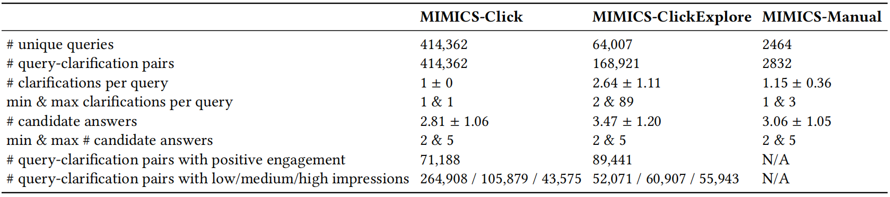

MIMICS-Click和MIMICS-ClickExplore的数据格式如下。这两个数据集已经过精细的预处理过程：

MIMICS-Manual是由专业人员进行标注的数据集。标注人员对澄清问题、候选答案集以及没个候选答案的落地页进行评分，分为Good、Fair和Bad三个等级：

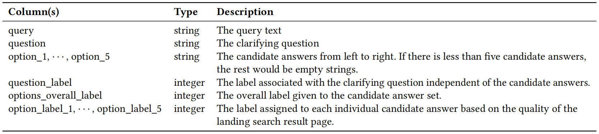

对于**澄清问题生成**任务，可以使用MIMMICS的点击数据进行模型的训练，并且使用BLEU或ROUGE等指标来衡量生成问题的质量。然而这种评价方式与用户的满意度相关性差，因此不推荐。以下两种评价澄清问题生成任务的方式是值得推荐的：(1) 如果是真实系统，那么进行**在线实验(例如A/B测试)**将是一种可靠的评估方法，并且可以使用用户参与度(例如点击率)对模型进行比较。(2) 根据仔细定义的标准对澄清问题进行人工评价将是澄清问题生成评估的替代方法。此前，Zamani等人[2]使用这种评估方法。

对于**澄清问题选择**任务，MIMICS-ClickExplore数据可以用于训练和评估澄清问题选择(或重排)模型。一些排序评价指标，例如nDCG，可以直接用于澄清问题选择的评价。此外，由于用户在一个查询中只能看到一个澄清问题，因此澄清问题受关注的程度也可看做是一种评价指标。

### 6.6 总结

Qulac是一个小型的、对话式的数据集。

论文[1]采用一种简化的方式，利用预训练语言模型，在问题库中检索相关问题，并排序选择最优问题，提问给用户，系统根据用户的回答，使用传统的基于概率的语言模型进行文档检索。模型的评价专注于最终对文档检索性能的提升。

论文[4]使用一种变体Transformer结构将用户与系统的交互历史进行编码，既可以直接用于文档检索，又可以用于下一个澄清问题的选择。模型的评价也专注于最终对文档检索性能的提升。

MIMICS是一个大型的、选择式的数据集。

论文[2]利用查询重构数据定义了每个查询的不同方面，提出了三种澄清问题生成的有效方法，采用人工评价的方式，对澄清问题的质量、候选答案的质量以及点击候选答案后第二结果页的质量进行评价。

论文[3]以大量篇幅分析了用户与搜索系统的交互行为，得出了一些具有启发性的结论，并提出了一种用于澄清问题选择的模型。

论文[5]系统阐释了MIMICS数据集的格式。

### 参考资料

[1] Aliannejadi M, Zamani H, Crestani F, et al. Asking clarifying questions in open-domain information-seeking conversations. Proceedings of the 42nd International ACM SIGIR Conference on Research and Development in Information Retrieval. 2019: 475-484.

[2] Zamani H, Dumais S, Craswell N, et al. Generating clarifying questions for information retrieval. Proceedings of The Web Conference 2020. 2020: 418-428.

[3] Zamani H, Mitra B, Chen E, et al. Analyzing and Learning from User Interactions for Search Clarification. arXiv preprint arXiv:2006.00166, 2020.

[4] Hashemi H, Zamani H, Croft W B. Guided Transformer: Leveraging Multiple External Sources for Representation Learning in Conversational Search. Proceedings of the 43rd International ACM SIGIR Conference on Research and Development in Information Retrieval. 2020: 1131-1140.

[5] Zamani H, Lueck G, Chen E, et al. Mimics: A large-scale data collection for search clarification. arXiv preprint arXiv:2006.10174, 2020.

